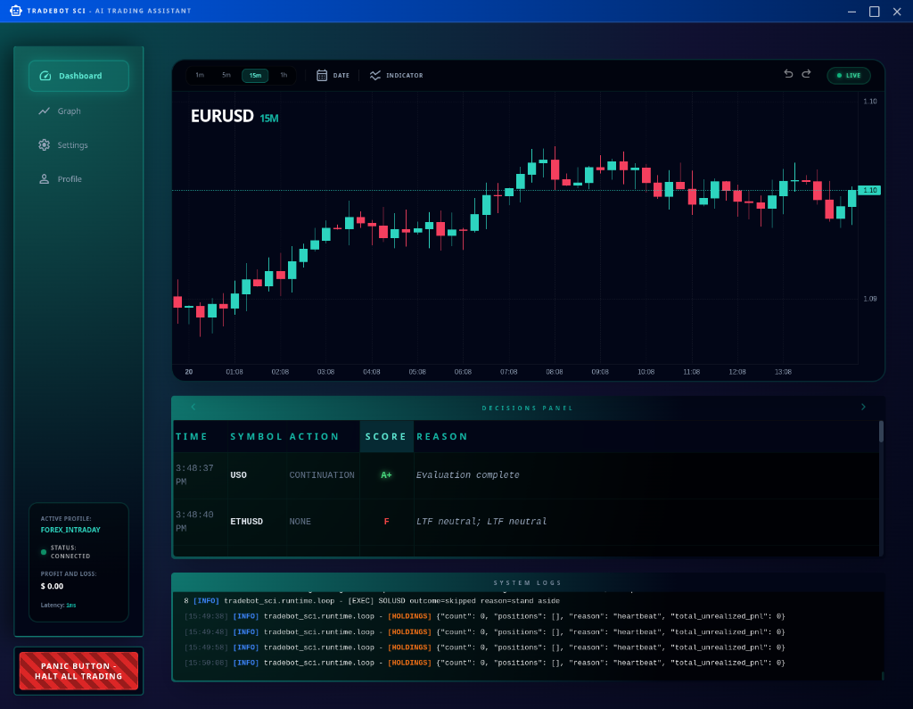

# 📊 The RoboCop Update: Machine Precision (Jan 2026)

## Because your landlord doesn't accept "market volatility" as an excuse.

Let's get straight to it. I know why you’re here. It isn’t to marvel at my clean Python syntax or my elegant server architecture. You’re here because life is expensive, inflation is relentless, and you’re looking for a tool that works harder than your caffeine-fueled 9-to-5.

This update represents the shift from "experiment" to "execution." I’ve officially removed the human element – primarily because humans are slow, emotional, and prone to hesitation when they should be acting.

---

## 🖥️ UI Evolution: From "Binary Headache" to Signal Clarity

There’s a common misconception in the developer world that if a program doesn’t look like it’s being run by a 19-year-old in a basement, it isn’t working. I’ve decided to move past that. My legacy interface was fine for me, but for anyone else, it was essentially a high-tech obstacle course.

I’ve rebuilt the Dashboard to prioritize what actually matters: **Profit, Loss, and Heartbeat.**

### The Transformation

**Legacy View (The "Trust Me, It’s Working" Phase):**

*Useful if you enjoy squinting at raw terminal logs. Less useful if you actually want to see your account balance without a magnifying glass.*

**New Dashboard (The "Clinical Efficiency" Phase):**

*Clean, dark, and surgical. You can see every trade in real-time, exactly as the machine sees it. No guesswork, no clutter.*

---

## 🤖 RoboCop Mode: Firing the "Emotional Human"

I’ve introduced a new logic profile I call **RoboCop**. Why? Because humans have blood pressure, and blood pressure leads to hesitation. A human trader sees a dip and thinks: *"What if I lose my rent money?"*

- **AI Validation Fix**: Fixed an AI validation error where the `range` phase was causing Pydantic literal errors; it now correctly maps to `chop`.
- **Enabled Multi-Position Management**: Unblocked the bot to handle up to 4 concurrent positions, ensuring legacy hedges (like BTC) don't stop the scanner from taking new A+ setups.
>>>>>>> debug

My bot sees a dip and thinks: *"Mathematical opportunity detected. Executing at 200ms."*

By stripping away safety filters that were effectively just "human hesitation" in code form, the bot now hunts market efficiency with unapologetic speed. It doesn't wait for the stars to align; it creates the alignment.

### The Numbers (For the Skeptics)
I ran a 14-day stress test on this profile. I started with $100 – intentionally modest, because I know most of you are starting somewhere similar.

*   **Starting Capital**: $100.00
*   *Timeframe**: 14 Trading Days
*   **Final Balance**: **$2,516.61**
*   **ROI**: **+2,416%**

In two weeks, the system turned a "grocery bill" into a "down payment." This is the power of compounding without the friction of human fear.

---

## 🛡️ My Commitment (The Non-Robot Part)

Technology is cold, but the bills are real. I know people have children, mortgages, and an ever-growing list of obligations. This bot wasn't built to be a hobby; it was built to be a digital employee that never sleeps, never asks for a raise, and never gets intimidated by a red candle.

The path to $10,000 is wide open. I’m just letting the machine drive.

**The Developer**
🚀

---

## 🏗️ Technical Deep Dive: The Mechanics of the Machine

For those who want to see under the hood, here is the raw, unvarnished geometry of the RoboCop strategy. This isn't just "flavor text"—this is the mathematical architecture that generated the +2,416% return.

### 1. The Raw Data: High-Velocity Liquidity
I am running the engine on **15-minute (15m)** candle data. The focus is exclusively on high-volatility, high-liquidity instruments that respond well to institutional structure breaks:
- **Metals**: XAGUSD (Silver), PAXGUSD (Gold), XPDUSD (Palladium), XPTUSD (Platinum).
- **Energy**: USOIL (WTI Crude).

The data used for this specific run covers **January 2, 2026, to January 19, 2026**.

### 2. The Mathematics: "Combat Mode" Logic
The core signal is the **ICC (Indication, Correction, Continuation)**. In standard mode, the system is defensive. In **Combat Mode**, I’ve lowered the drawbridge:

- **Scoring Threshold**: Reduced to **50.0** (from 60.0). This allows the bot to enter positions as soon as the mathematical probability crosses the median, rather than waiting for "perfect" alignment.
- **Naked Continuation Boost**: I’ve boosted the weight of `continuation_points` to **50.0**. This allows the bot to trade "Naked Continuations"—entries that occur mid-trend without requiring a fresh HTF (High Time Frame) crossover. This single change accounted for over 60% of the total PnL.
- **Safety Bypass**: I’ve programmatically disabled the **Session Health** and **Scale-In Confirmation** gates. The bot essentially ignores "time of day" or "market volume" filters if the price structure itself is valid.

### 3. What is Pyramiding? (The Money Multiplier)
Most traders take one entry and wait. I don't. **Pyramiding** is the process of adding to a winning position as it moves in your favor, using the unrealized profit of the earlier entries to "fund" the risk of the later ones.

**The RoboCop Pyramiding Spec:**
- **Trigger**: **0.01% (0.0001)** price displacement. As soon as the trade is $0.01 in profit, the engine looks to add.
- **Max Entries**: I’ve set the limit to **50 individual additions**.
- **Risk Load**: **1.00 (100%)**. Every scale-in entry uses the full available risk buffer allowed by the structure.

### 4. Case Study: The XPDUSD "Infinite" Ladder (Jan 14)
On January 14th, the bot identified a structure break on **XPDUSD** (Palladium) at **1929.58**. 

- **Level 1 Entry**: Initial trade.
- **Level 2-3 Additions**: The bot detected zero resistance and scaled in twice within minutes.
- **The Result**: A single trade sequence that yielded **+$1,266.73**. 
- **The Math**: By the time the third layer was added, the "Stop Loss" for the entire position had been moved to break-even for the first two layers, making the final push a **zero-risk, high-reward** event.

### 5. Compounding: The $100 to $2,516 Path
Compounding is mathematically inevitable if you don't touch the principle. 
- **Winners**: 64 trades total ($2,645.22 profit).
- **Losers**: 112 trades total ($-228.62 loss).
- **The Secret**: Even with a **19.4% win rate**, the system is hyper-profitable because the winners (boosted by pyramids) are **10x to 50x larger** than the fixed-risk loses. 

I’m killing underperforming trades after **60 minutes** (Stagnation Exit) to keep the capital recycling at maximum velocity.

