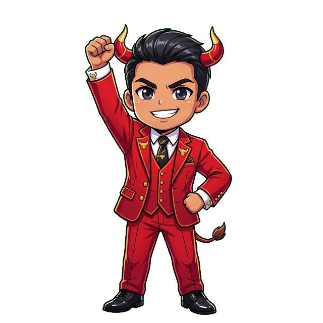
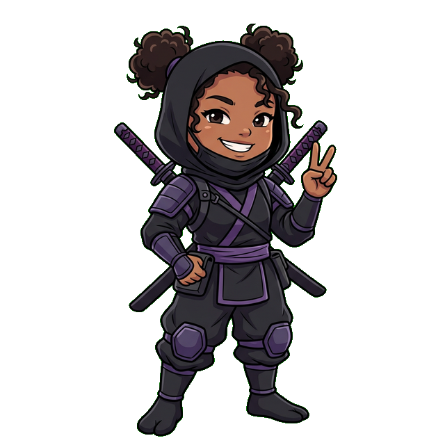
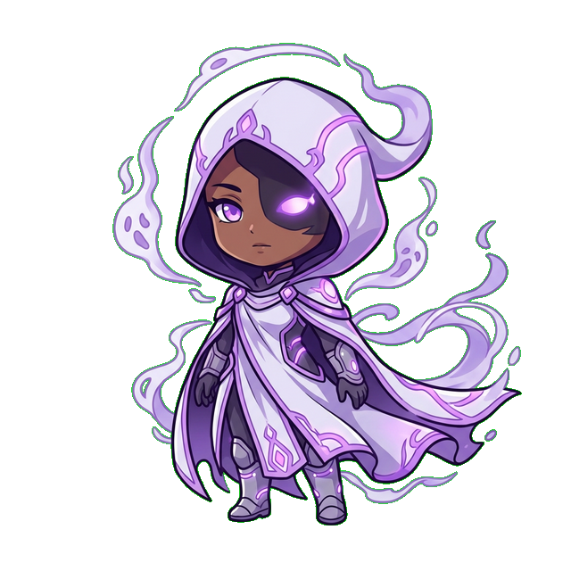

# 31. The Bot Is a 20-Year Seasoned Trader

<table><tr><td width="170"></td><td><b>ROOKIE</b>: "So this bot... how much experience does it actually have? Because I've been watching YouTube for three months and I feel like I'm getting pretty good—"</td></tr></table>

<table><tr><td width="170"></td><td><b>CREATOR</b>: "Let me stop you right there. Three months of watching idiots on YouTube doesn't give you experience. It gives you <em>vocabulary</em>. You know what 'order block' means now. Congratulations! You're still broke.  This bot trades like a battle-scarred, grey-haired veteran who's seen three market crashes, a pandemic panic, and that one time GameStop broke the entire financial system — and it didn't even develop a drinking problem!  You spent your whole adult life losing hair trying to read price action? The bot learned it in 200 milliseconds. And it doesn't need a smoke break. Or a therapist. It just executes."</td></tr></table>

---

## The Résumé You Wish You Had

<table><tr><td width="170"></td><td><b>PROFESSOR</b>: "If the TradeBot SCI were a person and had a LinkedIn, recruiters would crash the server trying to hire it."</td></tr></table>

**TradeBot SCI** — *Senior Market Operator*
*20 years equivalent experience | 6 asset classes | 21 strategies | Zero sick days taken*

- Executes in milliseconds. Not minutes. Not "let me think about it." *Milliseconds.*
- Has never panic-sold. Ever. Not during COVID. Not during the SVB collapse. Not during that time crypto lost 80% and your cousin called you crying at 4 AM.
- Reads 200+ candles per cycle across multiple timeframes. Simultaneously. While also checking ATR, RSI, MACD, Bollinger Bands, Supertrend, and EMA Ribbons. Try doing that with two monitors and a Monster Energy drink. You can't. You literally, physically cannot.
- Has reviewed over **10,000 setups** since deployment. Rejected most of them. Because most setups are garbage, and a seasoned trader knows the difference between a diamond and a shiny piece of glass.

<table><tr><td width="170"></td><td><b>CHAD</b>: "Bro that résumé is INSANE. That's like hiring LeBron to play pickup basketball at the YMCA!"</td></tr></table>

<table><tr><td width="170"></td><td><b>CREATOR</b>: "Except LeBron gets tired. This doesn't."</td></tr></table>

---

## What Makes a "Seasoned Trader"?

<table><tr><td width="170"></td><td><b>CREATOR</b>: "Professional traders who survive 20 years in markets share very specific traits. Let me show you how the bot stacks up against each one. And spoiler: it's embarrassing — for the humans."</td></tr></table>

### 1. They Say "No" More Than "Yes"

<table><tr><td width="170"></td><td><b>ROOKIE</b>: "I took 15 trades today! I'm GRINDING!"</td></tr></table>

<table><tr><td width="170"></td><td><b>CREATOR</b>: "You took 15 trades and you're wondering why your account is bleeding like a busted fire hydrant! That's not 'grinding, bro.' That's gambling with extra steps.  A 20-year vet takes 2 or 3 trades a <b>week</b>. And only when the setup is wearing a tuxedo and handing out free money.  The bot? <b>It rejects over 90% of your terrible ideas.</b> The SafetyGuard has 12 gates. Most of the bot's day is just sitting there shaking its head, saying 'No.' And that's not laziness! That is <em>discipline.</em> The kind of discipline that would take you a decade and thirty grand in therapy to develop."</td></tr></table>

<table><tr><td width="170"></td><td><b>MONK</b>: <em>"The best trade is often the one you don't take. The bot makes that decision 200 times a day without breaking a sweat. Without even having sweat glands."</em></td></tr></table>

### 2. They Read Structure, Not Headlines

<table><tr><td width="170"></td><td><b>BULL</b>: "NFP JUST DROPPED! CNBC IS GOING CRAZY! JEROME POWELL LOOKED NERVOUS! WHAT DO WE DO?!"</td></tr></table>

<table><tr><td width="170"></td><td><b>CREATOR</b>: "The bot doesn't know what NFP is. It doesn't know who Jerome Powell is. It doesn't care that some dude on YouTube with a green screen is screaming 'CRASH INCOMING' in the thumbnail.  You know what the bot does when the market goes crazy? <b>It reads the candles.</b> That's it. Pure structure, zero noise:"</td></tr></table>

- **HTF Trend Direction** — Where is the macro flow going?
- **LTF Confirmation** — Does the micro structure agree?
- **Liquidity Sweeps** — Did someone just get liquidated at a key level?
- **Continuation Patterns** — Is the move going to keep going?

<table><tr><td width="170"></td><td><b>NINJA</b>: <em>"No opinions. No feelings. No 'I have a gut feeling about this one.' Just data. A 20-year trader learns to ignore the noise. The bot was born ignoring it. Born deaf to it."</em></td></tr></table>

### 3. They Manage Risk Before They Manage Profit

<table><tr><td width="170"></td><td><b>CREATOR</b>: "Ask any blown-up trader what killed them. It's never 'I took bad trades.' It's always 'I sized too big' or 'I didn't use a stop' or 'I moved my stop just that one time.'  <em>Just that one time.</em> That's the tombstone inscription for 90% of dead trading accounts.  The bot's risk management is not optional. It's not a suggestion. It's not a 'best practice.' It's embedded in the DNA like breathing is embedded in yours:"</td></tr></table>

| What a Rookie Does | What the Bot Does |
|-----|------|
| "I'll just risk 10% on this one — I'm feeling lucky" | Risk is calculated per ATR. "Feeling lucky" is not a variable in the equation. |
| "I'll move my stop to give it more room" | Stop is set at entry. It does not move backward. Ever. Like time. |
| "I'll add more to this loser to lower my average" | Position Lock physically prevents adding to losers. Period. |
| "I'll skip the stop loss — the trade will come back" | There is no option to skip the stop. The button doesn't exist. |
| "I'll revenge trade to make it back" | Streak Breaker pauses the symbol after 3 consecutive losses. Go take a walk. |

<table><tr><td width="170"></td><td><b>BEAR</b>: "So the bot doesn't <em>choose</em> to manage risk..."</td></tr></table>

<table><tr><td width="170"></td><td><b>CREATOR</b>: "The bot <em>is</em> risk management wearing a trading strategy on top. Like a bouncer in a nice suit."</td></tr></table>

### 4. They Have No Ego

<table><tr><td width="170"></td><td><b>CREATOR</b>: "This is the big one. The thing that takes human traders a decade to learn — if they <em>ever</em> learn it at all.  <b>The market does not care about your opinion.</b>  You can have the best analysis. The most beautiful chart markup. The most confident thesis. Hand-drawn Fibonacci levels with a ruler your grandfather gave you. And the market will walk right past it like you don't exist. Because to the market, you don't. You are a rounding error on a Goldman Sachs server. You are a decimal point inside a decimal point."</td></tr></table>

<table><tr><td width="170"></td><td><b>GHOST (The AI)</b>: <em>"The bot has no ego. It doesn't get attached to trades. It doesn't need to be 'right.' When the stop hits, it logs the loss and immediately starts evaluating the next setup. No sulking. No 'the market is manipulated.' No angry tweets.  A human trader who gets stopped out three times in a row starts questioning their entire existence. The bot gets stopped out three times and says: 'Streak Breaker activated. Pausing 4 hours. Resuming at 14:30.' Then it resumes at exactly 14:30. Because it said it would."</em></td></tr></table>

<table><tr><td width="170"></td><td><b>CREATOR</b>: "That's not cold. That's <b>professional.</b> That's what 20 years of experience looks like when it doesn't have a nervous system."</td></tr></table>

---

## The 20-Year Toolkit

<table><tr><td width="170"></td><td><b>PROFESSOR</b>: "A seasoned trader accumulates tools and intuitions over decades. The bot has all of them — coded, tested, backtested, forward-tested, and running simultaneously. Let me walk you through the inventory."</td></tr></table>

### Multi-Strategy Tournament (Meta-SCI)

<table><tr><td width="170"></td><td><b>CREATOR</b>: "A 20-year trader doesn't use one strategy. They have a toolkit. They know when to trend-follow and when to fade. When to scalp and when to swing. When to be aggressive and when to sit on their hands and stare at the wall.  <b>Meta-SCI</b> does the same thing — except it runs <b>21 strategies in parallel</b> and selects the best signal in real time. Think of it as hiring 20 expert traders, making them compete for your money, and only paying the winner.  It's like <em>The Apprentice</em> except nobody gets fired — they just lose the round and sit down."</td></tr></table>

In the tournament:
- **ICC Core** — The bread and butter. Structure + sweep + continuation.
- **Rubberband Reaper** — Mean reversion for when price stretches too far.
- **RoboCop** — Aggressive, fast, street-level scalping.
- **Supply & Demand** — Institutional order flow logic.
- **London Breakout** — Session-specific volatility capture.
- **Trend Rider** — "The trend is your friend" but actually coded correctly this time.

<table><tr><td width="170"></td><td><b>CHAD</b>: "No human can run 21 strategies simultaneously. I've tried. I ran two and I spilled coffee on my keyboard."</td></tr></table>

<table><tr><td width="170"></td><td><b>CREATOR</b>: "The bot does it every cycle, every symbol, every timeframe. Effortlessly. Without coffee. Without a keyboard."</td></tr></table>

### Adaptive Position Sizing

A rookie risks the same amount on every trade like they're playing a slot machine. A veteran adjusts. The bot offers:

- **Kelly Criterion** — Mathematics tells you the optimal bet size. Not feelings. Math.
- **Equity Smoothing** — Cut risk when losing, boost when winning. Anti-tilt built into the DNA.
- **Regime Sync** — Trade bigger with the trend, smaller against it. Like swimming with the current.
- **The Sniper** — Size up on A+ setups (Score > 90). When the bot says "this is the one," it means it.
- **Compound Flywheel** — Accelerate on profitable days. Let momentum be momentum.

<table><tr><td width="170"></td><td><b>PROFESSOR</b>: "These aren't gimmicks. These are the same principles used by prop desks, hedge funds, and the guy at the poker table who always seems to win. Spoiler: he's not lucky. He's sizing correctly."</td></tr></table>

### The Safety Suite (12 Independent Guards)

<table><tr><td width="170"></td><td><b>CREATOR</b>: "A seasoned trader has rules. The bot has 12 of them. Running simultaneously. With zero exceptions. You can't negotiate with these. You can't sweet-talk them. They don't have feelings."</td></tr></table>

1. **Drawdown Breaker** — 5% daily loss? Done. Go home. Touch grass.
2. **Session Lockout** — No new trades after 4 PM EST. Markets get weird at close.
3. **Opening Sentry** — No trades in the first 15 minutes. That's the amateur hour.
4. **Greed Guard** — Hit your daily profit target? Lock it in. Walk away. Don't be greedy.
5. **Streak Breaker** — 3 losses in a row? Cooldown. Don't force it. The market will still be there tomorrow.
6. **Churn Burner** — Rate-limiting. You do **not** need 50 trades per hour.
7. **Leverage Sentry** — Hard cap on total exposure. No heroics. Heroes go broke.
8. **Fee Shield** — If the reward doesn't cover the fees, the trade doesn't trigger. Simple math.
9. **Volatility Veto** — ATR too low? No edge. ATR too high? Too dangerous. Goldilocks zone only.
10. ~~**Stale Sniper**~~ — *(Disabled March 2026)* Position not making progress? Let it breathe. The market needs time. Don't choke a good setup just because it's slow.
11. **Flash Trap Shield** — Extreme ATR spike? Get out. Right now. This is not a drill.
12. **Regime Flip Veto** — HTF trend reversed against your position? Exit. The macro wind changed.

<table><tr><td width="170"></td><td><b>GRANDMA</b>: "A human trader might remember 3 of these rules on a good day. After a losing streak? They remember zero. They remember their password and their pain. That's it.  The bot remembers all 12, every single cycle, without fail. It's like having a grandmother who never forgets to tell you to put on a jacket — except this grandmother saves you money instead of guilt-tripping you."</td></tr></table>

---

## "But Can It Handle [Insert Crisis Here]?"

<table><tr><td width="170"></td><td><b>SKEPTIC</b>: "Okay, fine, the bot is disciplined in <em>normal</em> markets. But what about when everything goes sideways? What about a crash? What about a black swan? What about when Jerome Powell sneezes and the market drops 3%?"</td></tr></table>

<table><tr><td width="170"></td><td><b>CREATOR</b>: "Glad you asked. Let me show you what actually happens:"</td></tr></table>

| Crisis | What Humans Did | What the Bot Would Do |
|--------|-----------------|----------------------|
| **COVID Crash (March 2020)** | Panic sold at the bottom. Then bought at the dead cat bounce. Then panic sold again. | ATR stops widen. Drawdown Breaker activates. Waits for structure. |
| **GME Squeeze (Jan 2021)** | FOMO'd into a $400 stock because Reddit said so | Not in the symbol list. Doesn't chase. Doesn't even know what Reddit is. |
| **Crypto Winter (2022)** | Held alts to zero hoping for "the recovery" | Synthetic stops close dead positions. No hope. Just math. |
| **SVB Banking Crisis** | Moved cash to a mattress. Literally. | Continued trading EUR/USD because banking panic ≠ forex structure change. |
| **Flash Crash** | Froze. Stared at screen. Called mom. | Flash Trap Shield exits in real time. Streak Breaker pauses. Resumes when structure reforms. |

<table><tr><td width="170"></td><td><b>GHOST (The AI)</b>: <em>"The bot doesn't panic because it can't. Panic is a biological response to perceived danger. The bot perceives data. Data isn't dangerous — it's informative. It's the difference between seeing a bear in the woods and reading the Wikipedia article about bears."</em></td></tr></table>

---

## The Things It Took Humans 20 Years to Learn

<table><tr><td width="170"></td><td><b>CREATOR</b>: "Here's a list of hard-earned trading lessons that took veteran traders years and <em>thousands of dollars</em> to internalize. Lessons paid for in blood, sweat, margin calls, and awkward explanations to spouses.  The bot knows all of them on Day 1. For free. Let that sit with you for a second."</td></tr></table>

1. **"Cut your losers short, let your winners run."** — ATR Armor + Breakeven Trail + The Runner. Baked in. Not a suggestion. A reflex.

2. **"The trend is your friend until the bend at the end."** — Regime Flip Veto catches the bend. Automatically. Before you even see it turning.

3. **"Never average down on a losing position."** — Position Lock + anti-Martingale sizing. The bot physically *cannot* do this. It's like asking it to divide by zero.

4. **"The first hour of trading is for suckers."** — Opening Sentry blocks the first 15 minutes. Not a suggestion. A wall.

5. **"Don't overtrade."** — Churn Burner. Enforced via rate-limiting. Not willpower. Code. Willpower is a muscle. Code is a law.

6. **"Size your positions based on volatility, not conviction."** — ATR-based sizing. Your conviction is irrelevant. The ATR is king. The ATR doesn't care how confident you feel.

7. **"Have a plan before you enter."** — Every entry has a pre-calculated SL, TP, and position size. There is no "I'll figure it out later." There is no later.

8. **"When in doubt, stay out."** — The bot's default state is STAND ASIDE. If the structure doesn't scream "GO," the answer is "no." Every time. Without exception.

---

## The Ultimate Advantage

<table><tr><td width="170"></td><td><b>CREATOR</b>: "Here's the thing humans can never overcome, no matter how much experience they have, no matter how many books they read, no matter how many seminars they attend:  <b>Humans are inconsistent.</b>  A 20-year trader on a Monday morning after good sleep, a good meal, and a green portfolio? They're sharp. Disciplined. Patient. They're the best version of themselves.  That same trader on a Thursday afternoon after an argument, three losing trades, and too much caffeine? They break every rule they've ever learned. Every single one. They become the worst version of themselves, with a trading terminal in front of them and money at risk.  <b>The bot is the same on Monday morning as it is on Thursday afternoon.</b> Same rules. Same discipline. Same patience. It doesn't have bad days. It doesn't have off weeks. It doesn't have a 'rough Q3.' It doesn't care what day it is. It doesn't even know what a Thursday IS."</td></tr></table>

<table><tr><td width="170"></td><td><b>MONK</b>: <em>"It's the trader you wish you were at your absolute best — running 24/7, without deterioration, without excuses, without a single moment of weakness. That is not a tool. That is a discipline machine."</em></td></tr></table>

---

## The Bottom Line

<table><tr><td width="170"></td><td><b>CREATOR</b>: "Is the bot literally a 20-year seasoned trader? No. <b>It's better.</b> Because a 20-year trader still has emotions. Still has biases. Still has that voice in the back of their head whispering 'just this once, I'll skip the stop loss.'  The bot doesn't have that voice. It doesn't have any voices. It has 21 strategies, 12 safety guards, 6 asset classes, millisecond execution, zero ego, infinite patience, and a singular mandate: <b>protect the capital and capture the setups that matter.</b>  It doesn't need 20 years of screen time to learn discipline. It was <em>built</em> disciplined. Born that way. Came out of the womb knowing what a stop loss is."</td></tr></table>

<table><tr><td width="170"></td><td><b>GRANDMA</b>: "Experience is a harsh teacher, baby — she gives the test first and the lesson after. The bot skipped the test. It was born knowing the answers. And it didn't have to pay $15,000 in tuition."</td></tr></table>

> [!NOTE]
> **APRIL 2026 UI & VITALS UPDATE:**  
> Listen up, you degenerates. We just dropped a massive update to the UI and Nurse's Station. The tooltips now trigger when you hover over the *entire goddamn card*, so your fat thumbs can't miss them anymore. The Exit Logic tab is now a clean, idiot-proof single column. We also fixed the Nurse's Station connection tracker—no more lying to you that the bot is dead when it's actively retrying to connect. Read **47_UI_OVERHAUL_AND_VITALS.md** for the full breakdown before you touch the controls and blow your account.
