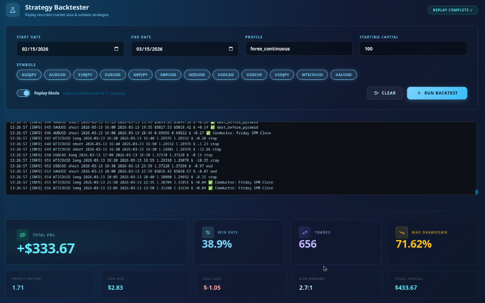
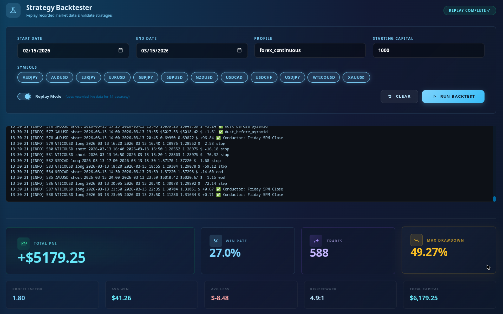

# Allergic to Money: Stop Playing With Me

<table><tr><td width="170"></td><td><b>CREATOR</b>: "I need everybody to stop what they're doing. Put the phone down. Actually — no. Pick the phone BACK UP, because this is the only time you're gonna use it for something that isn't destroying your life.  Look at me. Through the screen. In my eyes.  <b>Do you HATE money?</b>  No, I'm dead serious right now. I have never in my LIFE seen a group of human beings so violently allergic to financial improvement. I'm watching it happen in real-time. I have a group chat — a WHOLE group chat — full of grown adults. People with kids. People with car payments. People who complain about the price of eggs like eggs personally wronged them. And NOBODY. IS. TALKING.  Not a question. Not a 'hey, how does this work?' Not even a thumbs-up emoji. NOTHING. It's like I'm broadcasting into a cemetery. I'm out here sending screenshots, posting videos, damn near doing a TED Talk in your DMs, and I get back the energy of a doctor's waiting room at 7 AM.  You know what that tells me? Y'all don't want money. You are <em>afraid</em> of money. Money shows up at your front door with flowers, chocolates, and a briefcase full of cash, and you look through the peephole and go, 'Nah, I'm good.'"</td></tr></table>

<table><tr><td width="170"></td><td><b>SKEPTIC</b>: "I mean... I've been reading the messages. I'm just, you know, observing. Soaking it in."</td></tr></table>

<table><tr><td width="170"></td><td><b>CREATOR</b>: "SOAKING IT IN?! You've been 'soaking it in' for three months! You're not a sponge, you're a brick! Bricks don't soak up NOTHING — they just sit there! That's you! You're sitting in a group chat like a decorative brick, absorbing ZERO, contributing ZERO, and then you got the nerve — the AUDACITY — to text me privately and say, <em>'Oh, I just can't put down $100.'</em>  A hundred dollars. A HUNNIT. Yeah, I said HUNNIT. Because that's exactly how stupid it sounds. You can't put down a hunnit dollars? On YOURSELF? You can't invest one Benjamin Franklin — one dead president — into pulling yourself out of the financial ditch you've been living in since you graduated from that joke they call public education?  STOP. PLAYING. WITH. ME."</td></tr></table>

<table><tr><td width="170"></td><td><b>GRANDMA</b>: "Baby, I've seen people throw $100 into a slot machine at the Wynn and not even blink. But you mention 'investing' and suddenly they need to consult their financial advisor. Sweetheart, you don't HAVE a financial advisor. Your financial advisor is the voice in your head that told you to buy lottery tickets last Tuesday."</td></tr></table>

---

## The Exposed Hypocrisy of $100

<table><tr><td width="170"></td><td><b>PROFESSOR</b>: "Let's conduct a brief empirical analysis of how the average American actually deploys $100 in discretionary capital."</td></tr></table>

<table><tr><td width="170"></td><td><b>CREATOR</b>: "Allow me to translate that from Professor-speak into English: <b>let's talk about the dumb stuff you spend $100 on without thinking twice.</b>  You'll spend $100 on an ugly jacket. An UGLY one. Not even a nice jacket. A jacket that makes you look like a defective mannequin at Burlington Coat Factory. You'll wear it twice — once to the club and once to church — and then it'll live in the back of your closet for the rest of its miserable polyester life. $100. Gone. Poof. Don't even think about it.  You go to Five Guys. Five Guys! You order a burger, some fries, get a drink, and BAM — you just spent $75 on what is essentially a heart attack in a paper bag. You eat it in 12 minutes. TWELVE MINUTES. That's $6.25 per minute of chewing. A Michelin-star restaurant would be embarrassed to charge you that rate, but Five Guys does it with a straight face and you come back next week like a loyal dog.  Heck — some of you would literally DROP a hundred-dollar bill on the ground outside a gas station and NOT EVEN NOTICE. You'd walk right over Benjamin Franklin's face like he owed YOU money. You'd get home, check your pockets, and go, 'Huh. Coulda sworn I had cash.' And then you'd move on with your life. You wouldn't file a police report. You wouldn't cry. You'd just... forget.  But the SECOND — the MILLISECOND — I say, 'Hey, take that same hundred dollars and put it in a brokerage account where a mathematically disciplined, emotionally dead robot will trade it for you 24 hours a day while you sleep,' suddenly you turn into Warren Buffett's most conservative nephew. Suddenly you need to 'think about it.' Suddenly you need to 'do more research.' Suddenly you're sitting there scratching your chin like a fraud philosopher.  STOP. PLAYING. WITH. ME."</td></tr></table>

<table><tr><td width="170"></td><td><b>CHAD</b>: "I literally dropped $200 at Top Golf last weekend and I can't even hit the ball straight."</td></tr></table>

<table><tr><td width="170"></td><td><b>CREATOR</b>: "EXACTLY! Thank you, Chad! At least ONE person in this room has the self-awareness to admit they lit money on fire for entertainment! That's all I'm asking! Just be HONEST about where your money goes before you tell me you 'can't afford' a hundred bucks!"</td></tr></table>

---

## The Screenshot You Didn't Look At (Because You Don't Read Anything)

<table><tr><td width="170"></td><td><b>CREATOR</b>: "All right. You want proof? Here's proof. I know you didn't look at it last time because you don't look at ANYTHING I send. You probably skipped the video too. And the other screenshots. But I'm going to put it here AGAIN, because apparently being financially free requires me to show you the same picture more times than a preschool teacher shows flashcards.  This is what happens when you take that Five Guys money — that burger money, that jacket money, that 'oops I dropped it on the sidewalk' money — and you let the bot trade it for ONE month."</td></tr></table>

<table><tr><td width="170"></td><td><b>BULL</b>: "Hold on. $100 starting capital. $433.67 ending balance. That's a 333% return in 30 days?!"</td></tr></table>

<table><tr><td width="170"></td><td><b>CREATOR</b>: "YES, you beautiful bastard! $100 turned into over $400! That's not theory. That's not a spreadsheet projection. That's not some guru on YouTube standing in front of a rented Lamborghini telling you to 'believe in yourself.' That's a SCREENSHOT. From the ACTUAL BOT. Running on REAL recorded market data.  $400. You know what $400 is to someone who's struggling? That's a light bill. That's groceries for two weeks. That's the difference between 'I can breathe this month' and 'I'm robbing Peter to pay Paul again.'  But you won't do it. Because you hate money. You're sitting there with $100 burning a hole in your pocket, and instead of putting it somewhere that multiplies, you're gonna go buy something stupid. I can feel it. You're already thinking about Taco Bell."</td></tr></table>

<table><tr><td width="170"></td><td><b>GRANDMA</b>: "In my day, $100 was a month's groceries. Now $100 is one trip to the store and you still forgot the milk. The point is — the money disappears ANYWAY, baby. You might as well put it somewhere that makes MORE money instead of putting it somewhere that makes more cholesterol."</td></tr></table>

---

## The $1,000 Jordan Experiment (Yes, I'm Coming for Your Shoes)

<table><tr><td width="170"></td><td><b>CREATOR</b>: "Now let's talk about the $1,000 crowd. The sneakerheads. The drip lords. The people who will stand in line — IN LINE, outside, in the cold — for six hours to buy a pair of Jordans.  You'll drop a THOUSAND dollars on shoes. A thousand! For what? So you can walk around looking fresh? Fresh WHERE? Walking fresh to the bus stop? Looking crispy at the laundromat? You got $1,000 shoes and $4.37 in your checking account, and somehow you feel like you're winning.  And here's the part that kills me — Michael Jordan himself, the man whose NAME is on those shoes, basically told everybody they weren't made for YOU. He made them for athletes. For ballers. Not for guys working at Foot Locker trying to get an employee discount on their own product.  But forget all that. Take that Jordan money. That $1,000. Put it in the bot. Let it run the Forex Continuous profile for a month. Do you wanna see what happens?  Here. Look at it. Look at it, you damn bastard."</td></tr></table>

<table><tr><td width="170"></td><td><b>ROOKIE</b>: "...$6,179?! From a thousand?!"</td></tr></table>

<table><tr><td width="170"></td><td><b>CREATOR</b>: "$6,179.25. That's over FIVE THOUSAND DOLLARS in profit in one month. While you were sleeping. While you were at work pretending to care about your boss's PowerPoint. While you were arguing with strangers on Facebook about something that happened in 2019.  Five. Thousand. Dollars.  You know what you can do with $5,000? You can buy FIVE pairs of Jordans if your shoe-addicted brain still can't let go. Or — hear me out — you could pay off a credit card. Put a deposit on an apartment. Fix your car. Start an emergency fund for the FIRST TIME IN YOUR ADULT LIFE.  But no. You won't do it. Because you'd rather look fly than BE free."</td></tr></table>

<table><tr><td width="170"></td><td><b>BEAR</b>: "Those are backtested results though. Past performance—"</td></tr></table>

<table><tr><td width="170"></td><td><b>CREATOR</b>: "Don't you DARE finish that sentence. Don't you dare give me that 'past performance doesn't guarantee future results' disclaimer that you read off the back of a Fidelity brochure you found in your dentist's waiting room. You know who says that? People who aren't performing. People who are sitting on the sidelines. People whose financial strategy is literally 'hope.'  Yes, it's backtested on recorded live market data. That's the POINT. It's showing you what actually happened with actual prices. This isn't a simulation drawn on a napkin. This is the bot doing its job with real data while you were doing NOTHING with real money."</td></tr></table>

---

## The Condom Vending Machine Generation

<table><tr><td width="170"></td><td><b>MONK</b>: <em>"Why do they resist the harvest, when the seeds have already been planted and the water has already been poured?"</em></td></tr></table>

<table><tr><td width="170"></td><td><b>CREATOR</b>: "I'll tell you why, Monk. Because they were raised in these condom vending machines they call Public Schooling.  For TWELVE YEARS — twelve! — you sat in a chair, raised your hand to ask permission to use the bathroom, and were taught that the path to financial stability is: go to school, get good grades, get a job, collect a paycheck every two weeks, and repeat until you die. That's it. That's the whole curriculum. That's the ENTIRE financial education plan for the richest country on the planet.  Nobody taught you about compounding. Nobody taught you about markets. Nobody taught you about passive income. But they DAMN sure taught you how to sit still and wait for a bell to ring. You were trained. TRAINED. Like a dog at obedience school. Sit. Stay. Wait for the treat. Good boy.  So when I come along and say, 'Hey, put some money in here, be patient for 30 days, and watch it grow,' your brain REVOLTS. Your programming kicks in. Your indoctrination says: <em>'Money is supposed to come fast! You work, you get paid. That's the deal!'</em>  You were trained to expect a paycheck in two weeks. Not a month. Not two months. Two WEEKS. So anything that requires more patience than a microwave dinner is automatically suspicious to you."</td></tr></table>

<table><tr><td width="170"></td><td><b>BEAR</b>: "So you're saying the education system—"</td></tr></table>

<table><tr><td width="170"></td><td><b>CREATOR</b>: "I'm saying YOU are broken! The system did exactly what it was designed to do! It produced a generation of impatient, dependent, financially illiterate worker bees who can't think beyond next Friday's direct deposit.  People who can't have patience even when it comes to their OWN finances. People who will wait 45 minutes for a table at Applebee's — APPLEBEE'S, where everything tastes like it was microwaved in the parking lot — but can't wait 30 days for their money to quadruple.  FORTY-FIVE MINUTES. For Applebee's. But 30 days is too long to change your financial life. Make it make sense."</td></tr></table>

---

## The Lamborghini Problem

<table><tr><td width="170"></td><td><b>CREATOR</b>: "You wanna know the saddest part? I'll tell you the saddest part.  In order to get people to pay attention — to LISTEN — to look at ACTUAL MATH, I literally have to show pictures of me in a Lamborghini. Ha! IMAGINE THAT!  The screenshots aren't enough. The math isn't enough. The videos aren't enough. The recorded backtests, the live results, the step-by-step explanations — none of it's enough. But the SECOND I post a picture in front of a Lambo? Oh, NOW you're interested. Now you're in the DMs. Now you're asking questions. Now you wanna talk.  I have to cosplay as a Miami crypto bro — gold chain, rented car, Instagram filter — just to get you to care about YOUR OWN BANK ACCOUNT. That's where we are as a society. The math has to come with a costume."</td></tr></table>

<table><tr><td width="170"></td><td><b>NINJA</b>: <em>"The warrior does not need to see the reward before he begins the training. He trusts that discipline will deliver what entertainment never could."</em></td></tr></table>

<table><tr><td width="170"></td><td><b>CREATOR</b>: "Exactly! But these people don't want to be warriors. They want to be spectators. They want to WATCH other people get rich and then say, 'Must be nice.' Yeah, it IS nice. You know what's not nice? Being broke and choosing to STAY broke because you're too scared to put a hundred dollars into a machine that does all the work for you."</td></tr></table>

---

## The Scrolling Dead

<table><tr><td width="170"></td><td><b>CREATOR</b>: "Let me paint a picture of what my group chat looks like. I want everyone to visualize this.  I wake up at 6 AM. I check the bot. I see it made five trades overnight. Three winners, two losers. Net positive. I screenshot the results. I write a clear, simple breakdown: 'The bot traded GBPJPY and EURUSD overnight. Here's the P&L. Here's how the strategy played out. Here's what the next session looks like.'  I post it to the group. Beautiful screenshot. Clear explanation. Actual money. Real trades.  Eleven people see it. ZERO people respond.  I post a VIDEO. A ten-minute walkthrough of how the bot works, what the buttons do, how to set it up. Ten minutes! That's shorter than a Netflix cold open!  Two views. TWO. Out of about ten people. And one of those views was probably me checking if the video uploaded correctly.  These people are the Scrolling Dead. They're in the group physically, but mentally they checked out before they even joined. They scroll past financial opportunity the same way they scroll past terms and conditions. Without reading. Without thinking. Without caring."</td></tr></table>

<table><tr><td width="170"></td><td><b>CHAD</b>: "To be fair, I watched the video. I just didn't know what to say."</td></tr></table>

<table><tr><td width="170"></td><td><b>CREATOR</b>: "How about 'HELP ME MAKE MONEY'?! How about 'Hey, can you explain step 3'?! How about 'I HAVE A QUESTION'?! It's a group chat, not a library! You're allowed to TALK! You're allowed to be confused! You're allowed to say 'I don't understand this' without being judged! That's the WHOLE POINT of the group!  But no. You sit there in silence. Scrolling. Reading but not reading. Looking but not seeing. You're a ghost haunting your own opportunity."</td></tr></table>

---

## The Real Talk

<table><tr><td width="170"></td><td><b>CREATOR</b>: "Look. I'm gonna bring it down for a second. Real talk. No jokes.  I'm not asking you to remortgage your house. I'm not asking you to empty your savings. I'm not asking you to do anything crazy. I'm asking you to look at where your money ACTUALLY goes — the jacket, the burger, the shoes, the Applebee's, the Top Golf, the whatever — and take ONE of those expenses and redirect it.  ONE HUNDRED DOLLARS. That's it. That's the ask.  You have bills. I know you do. We ALL do. But you also have money that you're lighting on fire every single week on things that don't build anything, don't grow anything, and don't move you one inch closer to the life you claim you want.  And listen — if you genuinely can't do it right now, that's real. I respect that. But don't tell me you 'can't afford it' while you're posting Instagram stories from a restaurant. Don't tell me you 'can't invest' while you're wearing shoes that cost more than most people's car note. Don't insult my intelligence and don't insult YOURS."</td></tr></table>

<table><tr><td width="170"></td><td><b>GRANDMA</b>: "Baby, when I was young, my mother used to say: 'The money you waste is the money that was trying to save you.' I didn't understand it then. I understand it now. Every dollar you spend on something that doesn't build your future is a dollar that's working AGAINST you.  That $100 jacket is negative $100. That $100 in the bot is potentially <em>positive</em> $333. The math ain't hard, sweetheart. But apparently, doing it is."</td></tr></table>

---

## The Bill Money Strategy (Read This or Stay Broke)

<table><tr><td width="170"></td><td><b>CREATOR</b>: "Okay, since y'all need the whole thing hand-delivered and spoon-fed like baby food, let me break this down into a strategy so simple that a toddler with a crayon could follow it.  You have a bill. Let's say it's $100. I don't care what the bill is — electric, phone, internet, whatever. You were gonna pay that bill anyway. That money was LEAVING your account no matter what.  Instead of paying it immediately, take that $100 and put it in your brokerage at the <b>start</b> of the month. Let the bot trade it for 30 days. At the end of the month, pull the original $100 back out and go pay your bill like you were going to anyway. The bill doesn't know the difference. The electric company doesn't care if the money aged like wine for 30 days before it showed up. A hundred bucks is a hundred bucks.  But the REST — the profit the bot earned — stays in the account. That's YOUR money now. That money didn't exist before. That money was born inside the brokerage while you were doing absolutely nothing.  Month 1: you started with $100. The bot turned it into roughly $400. You pull out your $100, pay your bill. You now have about $300 sitting in the brokerage that came from NOWHERE.  Month 2: put another $100 back in. Now you've got around $400 in the account again. The bot runs it. At the end of the month, you've got around $1,000. Pull out the $100, pay your bill. You've now got $900 in there.  Month 3: you don't even need to add anything. That $900 can compound on its own. Markets can be finicky, sure — some months are better than others — but that has the potential to grow into <b>several thousand dollars</b>. From two months of lending your bill money to a robot.  Do you understand what just happened? That $100 literally went to its own 9-to-5 and worked FOR YOU. It packed a boxed lunch, put on a hard hat, clocked in at the market, and came home with a paycheck. Except unlike YOUR 9-to-5, it didn't complain about the commute. It didn't ask for a raise. It didn't call in sick on a Monday. It just WORKED. Every single day. Around the clock. While you were living your life.  Two months of lending your bill money. That's it. That's the whole play. And by month 3, that money is making money that makes money. Your hundred-dollar bill became an employee. And that employee hired more employees. And none of them need health insurance."</td></tr></table>

<table><tr><td width="170"></td><td><b>PROFESSOR</b>: "For the mathematically inclined:  Month 1: $100 → ~$400. Withdraw $100. Remaining: ~$300. Month 2: $300 + $100 deposit = $400 → ~$1,000. Withdraw $100. Remaining: ~$900. Month 3: $900 compounds unassisted → potentially $3,000–$6,000.  Total invested from your pocket: $200. Total bill payments missed: zero. Net new wealth created by the bot: potentially thousands. The math isn't magic. It's just math that nobody taught you in school."</td></tr></table>

<table><tr><td width="170"></td><td><b>GRANDMA</b>: "Baby, you're telling me I can pay my light bill AND make money? At the same time? With the SAME hundred dollars?"</td></tr></table>

<table><tr><td width="170"></td><td><b>CREATOR</b>: "YES, GRANDMA! That's EXACTLY what I'm telling you! The hundred dollars does a SHIFT and comes back! It's the hardest-working employee you've ever had, and you don't even have to feed it!"</td></tr></table>

---

## The Bottom Line (For the Love of God)

<table><tr><td width="170"></td><td><b>CREATOR</b>: "Here's what I know:  $100 becomes $400. I showed you the screenshot. Multiple times. You probably still didn't look at it.  $1,000 becomes $6,000. I showed you that screenshot too. You didn't even double-tap it.  The bot runs 24 hours a day. It doesn't sleep. It doesn't get emotional. It doesn't revenge-trade because it had a bad day. It doesn't FOMO into a position at 2 AM because it saw a candle that 'looked promising.' It trades like a machine, because it IS a machine.  All you had to do was fund the account. All you had to do was click a button. All you had to do was care about your own financial future as much as you care about what shoes you're gonna wear this weekend.  But you won't. Because you're allergic to money.  Take your Benadryl. Fund your account. Or stay broke. I can't want it for you more than you want it for yourself.  But STOP sitting in my group chat like a potted plant and then telling me you 'can't afford it' while you're eating a $22 burrito.  Stop playing with me."</td></tr></table>

<table><tr><td width="170"></td><td><b>MONK</b>: <em>"The door is open. It has always been open. The only thing standing between you and the other side... is you deciding to stop looking at it and actually walk through."</em></td></tr></table>
