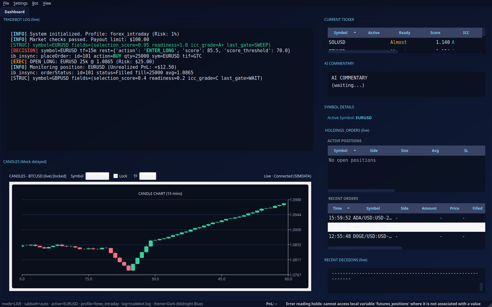
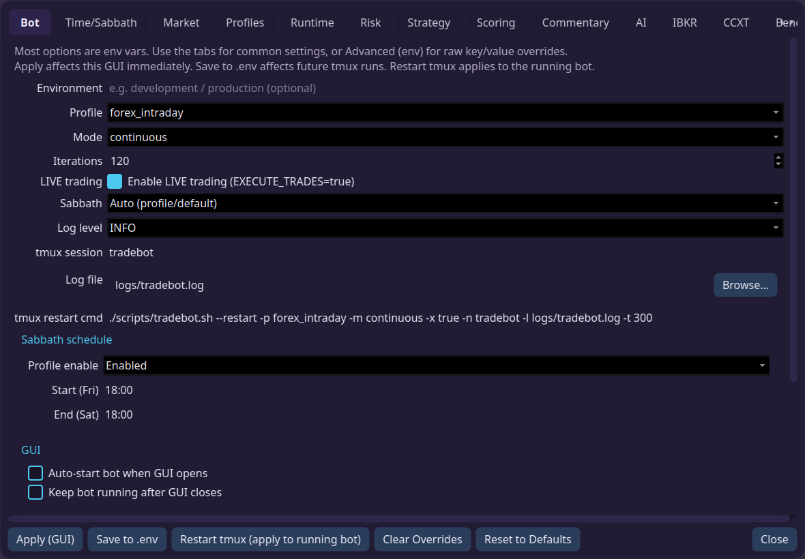

# Tradebot SCI Enterprise - AI Trading Assistant



> **"Automated ICC Trading for IBKR, Crypto, and Futures."**
> 
> This bot scans the market, identifying **Indication > Correction > Continuation** (ICC) structures, and executes them with institutional discipline. It is "Trade By SCI" logic codified into a machine.

---

> [!CAUTION]
> **USE AT YOUR OWN RISK.**
> 
> The author is in **no way, shape, or form responsible** for what this application may or may not do.
> 
> This is an automated trading tool that executes real orders with real money. If you decide to put your life savings into an account and have the bot gamble it away, **that is on you.**
> 
> **You have been warned.** Test thoroughly on paper/sim before risking a Single. Cent.

---

## 1. Prerequisites (Do this first)

Before you clone anything, ensure you have the following:

1.  **Python 3.11+**  
    *   Required. The bot uses modern async features.
2.  **Poetry**  
    *   We use poetry for dependency management. Install via: `pip install poetry`
3.  **IBKR TWS or Gateway** (Optional but Recommended)
    *   If you plan to trade Equities/Futures via Interactive Brokers, you need TWS running and accepting API connections (Port 7497/7496).
4.  **API Keys**
    *   **AI Provider**: OpenAI (or compatible) key for the decision engine.
    *   **Exchange**: Settings for IBKR or CCXT (Binance/Coinbase) keys.

## 2. Installation & Quickstart

### Step 1: Clone the Repository
Use the **Public Mirror** to get the latest stable version.

```bash
git clone https://gitlab.com/ultraedge/tradebot-public.git
cd tradebot-public
```

### Step 2: Install Dependencies
Install the project environment including GUI dependencies.

```bash
python -m venv .venv
source .venv/bin/activate
poetry install --with gui
```

### Step 3: Configure Environment
Copy the example configuration and add your keys.

```bash
cp .env.example .env
# Edit .env and add your TRADE_SCI_API_KEY / CHATGPT_KEY
```

> **Tip:** You can edit settings manually in `.env` OR use the GUI Settings window later.

### Step 4: Launch the Bot
The easiest way to start is the **GUI Dashboard**. It handles the bot process, logging, and configuration for you.

```bash
./scripts/tradebot.sh --gui
```

*(Or just open settings: `./scripts/tradebot.sh --settings`)*



**In the GUI:**
1.  Go to **Settings → AI** to verify your provider/model.
2.  Go to **Settings → Broker** to configure IBKR or CCXT.
3.  Go to **Settings → Bot** to adjust Risk/Strategy parameters.
4.  **Start** the bot!

---

## 3. The Strategy: "Hybrid Flip"

This bot is not designed to scalp for pennies. It is an **Asymmetric Growth Engine**.

### The Logic (Indication → Correction → Continuation)
We do not chase candles. We wait for Structure.
1.  **Indication**: The market breaks structure (BOS) in a direction.
2.  **Correction**: Price retraces into a discount (sweep).
3.  **Continuation**: We enter solely on confirmed resumption of trend (A+ Setup).

### The Money Management (Feet Wet → Full Send)
1.  **Probe (1% Risk)**: "Feet Wet". We risk the price of a coffee. If we lose, we don't care.
2.  **Load (30% Risk)**: If the Probe validates (profit > 0.15%), we deploy size.
3.  **Pyramid (Scale)**: We add to winners aggressively while moving stops to Breakeven.

> **Result:** We take many small "papercut" losses ($5) to catch the one violence run that pays $800+.

*See [Documentation/STRATEGY_ADVISORY.md](Documentation/STRATEGY_ADVISORY.md) for deep dives on the math.*

---

## 4. Documentation & Reference

This README is just the lobby. The real knowledge is in the **RTFM (Read The Manual)** folder.

| Topic | Document |
| :--- | :--- |
| **Why?** | [01_PHILOSOPHY.md](Documentation/RTFM/01_PHILOSOPHY.md) - The "Why we built this" manifesto. |
| **How?** | [02_SKELETON_ARCH.md](Documentation/RTFM/02_SKELETON_ARCH.md) - How the code works. |
| **Controls** | [07_COCKPIT_CONTROLS.md](Documentation/RTFM/07_COCKPIT_CONTROLS.md) - How to fly the plane. |
| **Config** | [13_ENV_VARS.md](Documentation/RTFM/13_ENV_VARS.md) - **The Reference Table** (Env Vars). |
| **Testing** | [09_TIME_MACHINE.md](Documentation/RTFM/09_TIME_MACHINE.md) - Historical Backtesting Guide. |

---

### Command Line Cheat Sheet
For advanced users who prefer the terminal/tmux:

```bash
# Standard Launch (TMUX Dashboard)
./scripts/tradebot.sh

# Headless / Continuous Crypto Mode
./scripts/tradebot.sh --profile crypto_247 --mode continuous

# Help
./scripts/tradebot.sh --help
```

### Key Concepts
*   **Safety First**: By default, `EXECUTE_TRADES=false`. You must explicitly enable live trading.
*   **Sabbath Mode**: The bot can auto-pause new entries from Friday Sunset to Saturday Sunset (configurable).
*   **Venues**: Supports IBKR (Equities/Forex) and CCXT (Crypto).

---

> *"Proceed to the RTFM folder. But never forget why you are here. You are here to pay the bills."*
