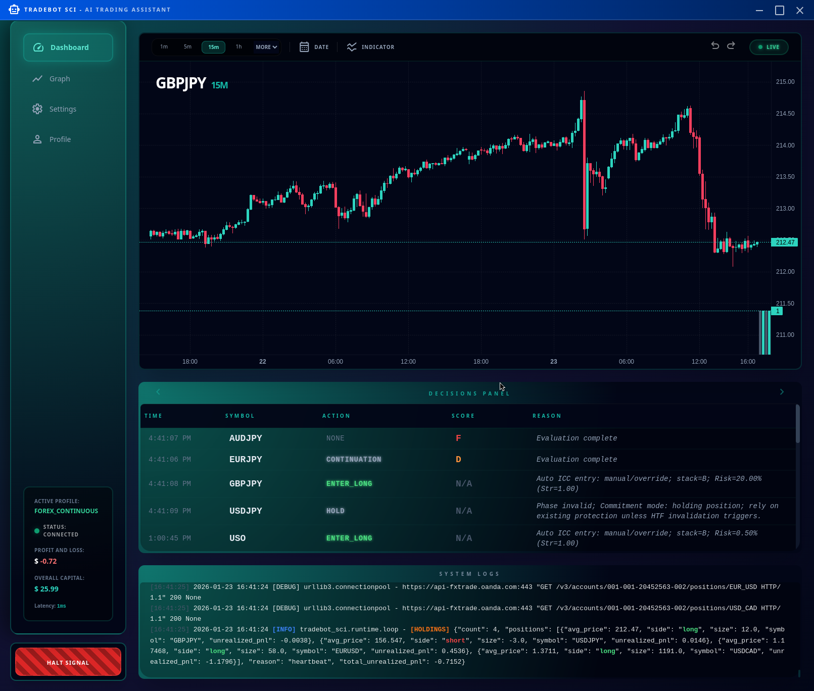
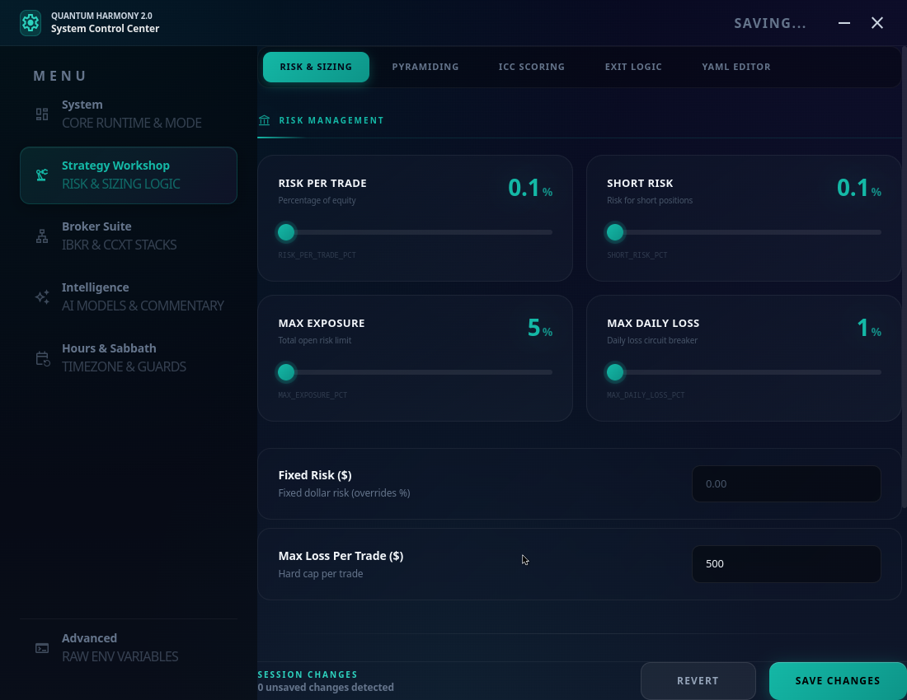

# Tradebot SCI Enterprise - Multi-Strategy Trading System



> **"9 Strategies. 6 Asset Classes. One Unified Platform."**
>
> An automated trading system supporting stocks, forex, crypto, ETFs, metals, and futures across Interactive Brokers, OANDA, and crypto exchanges. Choose the right strategy for each asset class — from aggressive scalping to patient trend-following.

---

> [!CAUTION]
> **USE AT YOUR OWN RISK.**
>
> The author is in **no way, shape, or form responsible** for what this application may or may not do.
>
> This is an automated trading tool that executes real orders with real money. If you decide to put your life savings into an account and have the bot gamble it away, **that is on you.**
>
> **You have been warned.** Test thoroughly on paper/sim before risking a Single. Cent.

---

## What's New

- **9 Trading Strategies** — From mean reversion to momentum breakouts
- **Per-Asset Strategy Selection** — Different strategies for crypto vs forex vs stocks
- **OANDA Integration** — Full forex support via OANDA API
- **Coinbase Futures** — Trade nano BTC/ETH futures (US compliant)
- **Tiered Risk System** — Anti-martingale money management
- **Beautiful Settings GUI** — Intuitive Electron-based configuration

---

## Trading Strategies

Choose the right strategy for each asset class. Each has different strengths:

| Strategy | Style | Risk | Best For |
|----------|-------|------|----------|
| **Rubberband Reaper** | Mean Reversion | Adaptive | Ranging markets, volatile assets. Anti-martingale sizing (+7,036% verified) |
| **RoboCop** | Aggressive Scalping | High | Trending markets, high volatility. 1-bar confirmation, 3.0 ATR targets |
| **Robot Evolution** | Range Trading | Low-Medium | Sideways markets. Trades NTZ (No-Trade-Zone) edges |
| **Quantum** | Trend Following | Medium | Strong trending forex. SMA pullback entries |
| **Mean Reversion** | Mean Reversion | Medium | Ranging crypto/forex. Bollinger + RSI extremes |
| **HyperScalper** | Fast Scalping | High | Liquid forex, fast markets. 9/21/200 EMA crossovers |
| **London Breakout** | Breakout | Medium | GBP pairs, European session. Opening range breakouts |
| **Volatility Breakout** | Breakout | Medium-High | Any compressed market. Catches range expansion |
| **Singularity Aggregator** | Multi-Strategy | Variable | Maximum capital efficiency. Runs 2 strategies in parallel |

### Per-Asset Strategy Assignment

The bot can use different strategies for different asset classes:

```yaml
strategies:
  crypto: rubberband_reaper    # Anti-martingale for volatile crypto
  forex: rubberband_reaper     # Proven on EUR/USD, GBP/JPY
  stocks: quantum              # Trend-following for equities
  etf: quantum                 # Works well on SPY, QQQ
  metals: mean_reversion       # Gold/Silver tend to range
  futures: volatility_breakout # Catch breakouts on ES, NQ
```

Configure this in the **Settings → Strategy Workshop → Asset Strategies** tab.

---

## Supported Brokers

| Broker | Asset Classes | Status |
|--------|---------------|--------|
| **Interactive Brokers** | Stocks, ETFs, Forex, Futures, Crypto | Full Support |
| **OANDA** | Forex, Metals | Full Support |
| **Coinbase (CCXT)** | Crypto Spot, Nano Futures | Full Support |
| **Other CCXT Exchanges** | Crypto | Experimental |

---

## 1. Prerequisites

Before you clone anything, ensure you have:

1. **Python 3.11+** — Required for modern async features
2. **Poetry** — Dependency management: `pip install poetry`
3. **Node.js 18+** — For the Electron GUI (optional but recommended)
4. **Broker Access** (at least one):
   - **IBKR TWS/Gateway** — Port 7497 (paper) or 7496 (live)
   - **OANDA Account** — API key from OANDA Hub
   - **Coinbase Advanced** — API key for crypto
5. **AI Provider Key** — OpenAI, Gemini, Claude, or DeepSeek

---

## 2. One-Click Installation (Recommended)

The easiest way to get started is using our universal installer. It handles all system dependencies, Python, Node.js, and even creates a **Desktop Shortcut** for one-click access.

```bash
git clone https://gitlab.com/ultraedge/tradebot-public.git
cd tradebot-public
chmod +x scripts/install.sh && ./scripts/install.sh
```

> [!TIP]
> Once finished, you can launch the bot directly from your **Applications Menu** or **Desktop**!

### Manual Configuration (Advanced)
If you prefer to set up manually, please refer to the [Legacy Installation Guide](Documentation/installation_manual.md) (or use `poetry install --with gui`).

### Step 3: Configure Environment
```bash
cp .env.example .env
# Edit .env with your API keys
```

Key variables to set:
```bash
# AI Provider
TRADE_SCI_PROVIDER=gemini
CHATGPT_KEY=your-api-key

# Broker (choose one or more)
IBKR_HOST=127.0.0.1
IBKR_PORT=7497

OANDA_ACCOUNT_ID=101-001-xxxxx-001
OANDA_API_KEY=your-oanda-token

CCXT_EXCHANGE=coinbase
CCXT_API_KEY=your-coinbase-key
CCXT_SECRET=your-coinbase-secret
```

---

## 3. Launch

### GUI Mode (Recommended)

```bash
./scripts/tradebot.sh --gui
```

This opens the dashboard where you can:
- Start/Stop the bot
- Monitor trades in real-time
- Adjust settings with visual controls

### Settings Only

```bash
./scripts/tradebot.sh --settings
```



### Headless / Terminal Mode

```bash
# Standard launch with TMUX dashboard
./scripts/tradebot.sh

# Specific profile
./scripts/tradebot.sh --profile forex_continuous

# Continuous crypto mode
./scripts/tradebot.sh --profile crypto_247 --mode continuous
```

---

## 4. Configuration Profiles

Pre-configured profiles for different trading styles:

| Profile | Focus | Session |
|---------|-------|---------|
| `forex_continuous` | Forex pairs via OANDA | 24/7 (Sabbath excluded) |
| `forex_intraday` | Forex via IBKR | Market hours |
| `crypto_247` | Crypto spot | 24/7 |
| `coinbase_futures` | Crypto futures | 24/7 |
| `coinbase_futures_nano` | Nano BTC/ETH futures | 24/7 |
| `auto_schedule` | Auto-switches equity/crypto | Smart scheduling |
| `intraday` | Equities intraday | 9:30-4:00 ET |
| `swing` | Multi-day holds | Daily candles |
| `scalp` | 1-minute scalping | Any |

Select your profile in **Settings → System → Active Profile**.

---

## 5. Risk Management

### Tiered Anti-Martingale System

The bot uses adaptive risk that **increases after wins** and **decreases after losses**:

| Account Size | Risk Per Trade |
|--------------|----------------|
| Below $1,000 | 20% (aggressive growth) |
| $1,000-$5,000 | 10% (growth) |
| Above $5,000 | 1-5% (capital preservation) |

### Pyramiding (Scaling Into Winners)

1. **Probe Entry** (1% risk) — "Feet Wet" initial position
2. **Load** (30% risk) — Add when trade proves profitable
3. **Scale** (10% risk) — Continue adding to winners

### Safety Features

- **Max Daily Loss** — Circuit breaker stops trading if exceeded
- **Sabbath Mode** — Auto-pause Friday sunset to Saturday sunset
- **Session Gates** — Only trade during liquid market hours
- **Breakeven Trailing** — Move stops to protect profits

---

## 6. The Core Logic

While the bot supports multiple strategies, they share common principles:

### ICC Framework (Indication → Correction → Continuation)

1. **Indication** — Market breaks structure in a direction
2. **Correction** — Price retraces (creates entry opportunity)
3. **Continuation** — Enter on confirmed trend resumption

### Multi-Timeframe Analysis

- **HTF (Higher Timeframe)** — Determines trend direction
- **LTF (Lower Timeframe)** — Precision entry timing
- **Alignment Required** — Only trade when timeframes agree

### AI Integration

Optional AI commentary for:
- Market context analysis
- Setup quality scoring
- Trade journaling

---

## 7. Documentation

| Topic | Document |
|-------|----------|
| **Philosophy** | [01_PHILOSOPHY.md](Documentation/RTFM/01_PHILOSOPHY.md) |
| **Architecture** | [02_SKELETON_ARCH.md](Documentation/RTFM/02_SKELETON_ARCH.md) |
| **Controls** | [07_COCKPIT_CONTROLS.md](Documentation/RTFM/07_COCKPIT_CONTROLS.md) |
| **Environment Vars** | [13_ENV_VARS.md](Documentation/RTFM/13_ENV_VARS.md) |
| **Backtesting** | [12_TIME_MACHINE.md](Documentation/RTFM/12_TIME_MACHINE.md) |
| **Multi-Strategy Plan** | [IMPLEMENTATION_PLAN_MULTI_STRATEGY.md](docs/IMPLEMENTATION_PLAN_MULTI_STRATEGY.md) |

---

## 8. Key Safety Notes

- **`EXECUTE_TRADES=false` by default** — You must explicitly enable live trading
- **Paper trade first** — Use IBKR paper (7497) or OANDA practice mode
- **Start small** — Test with minimum position sizes
- **Monitor actively** — Don't set and forget until you trust the system

---

## Command Reference

```bash
# Launch GUI dashboard
./scripts/tradebot.sh --gui

# Open settings only
./scripts/tradebot.sh --settings

# Terminal mode with specific profile
./scripts/tradebot.sh --profile forex_continuous

# Help
./scripts/tradebot.sh --help

# Run the Electron GUI directly
cd src/tradebot_sci/electron_gui && npm start
```

---

## License & Disclaimer

This software is provided as-is. Trading involves substantial risk of loss. Past performance (even verified backtests) does not guarantee future results. The developers are not financial advisors and this is not financial advice.

---

> *"The goal is not to be right. The goal is to make money when you're right and lose little when you're wrong."*
