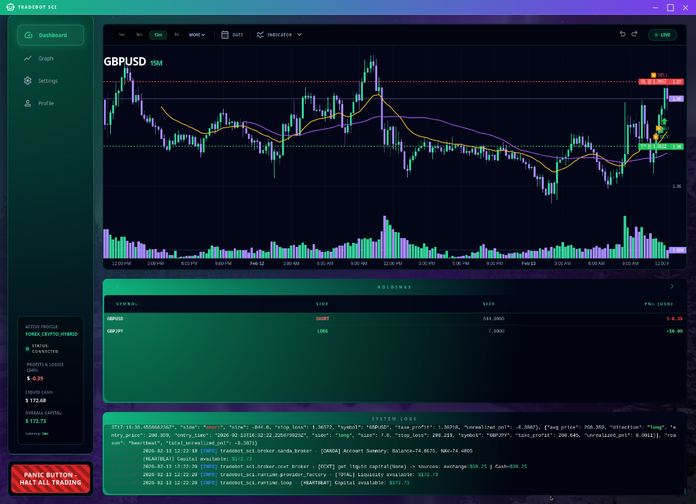
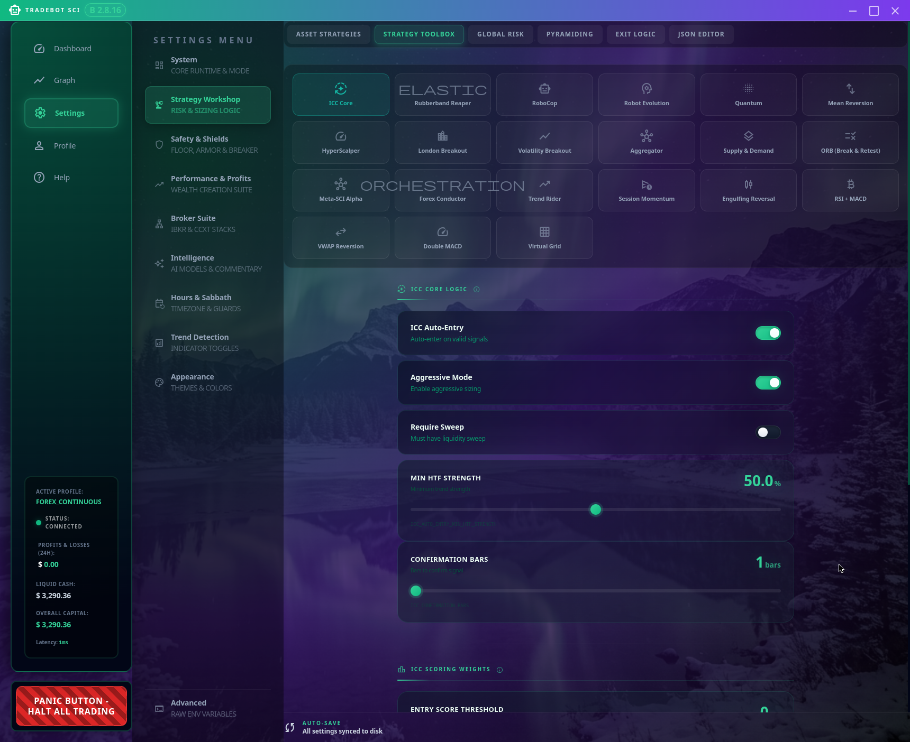
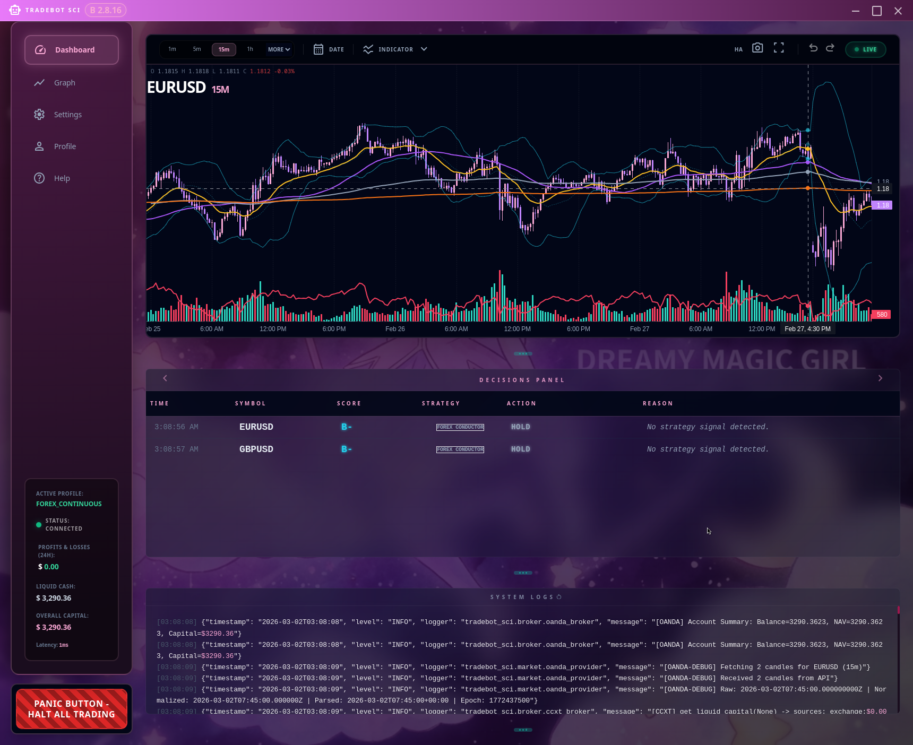
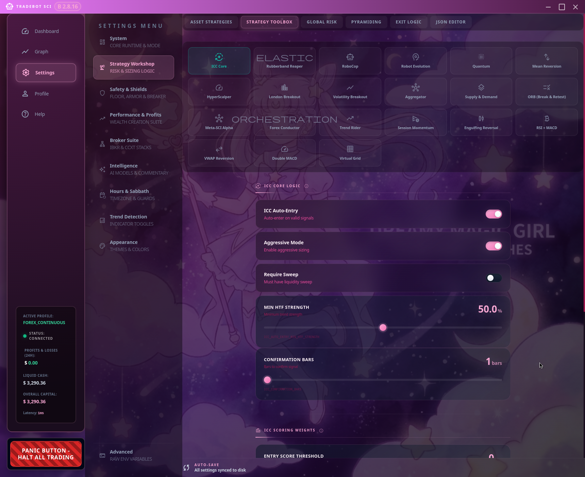
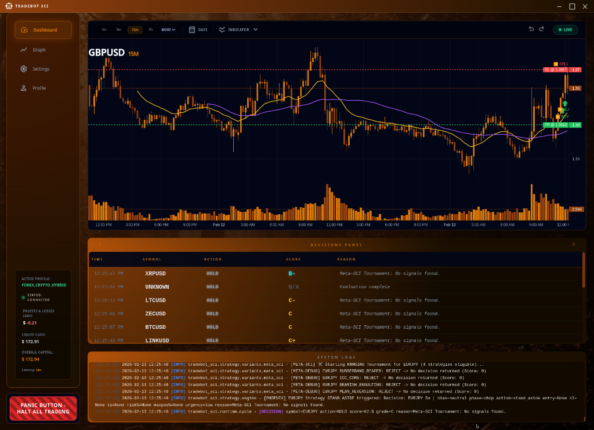
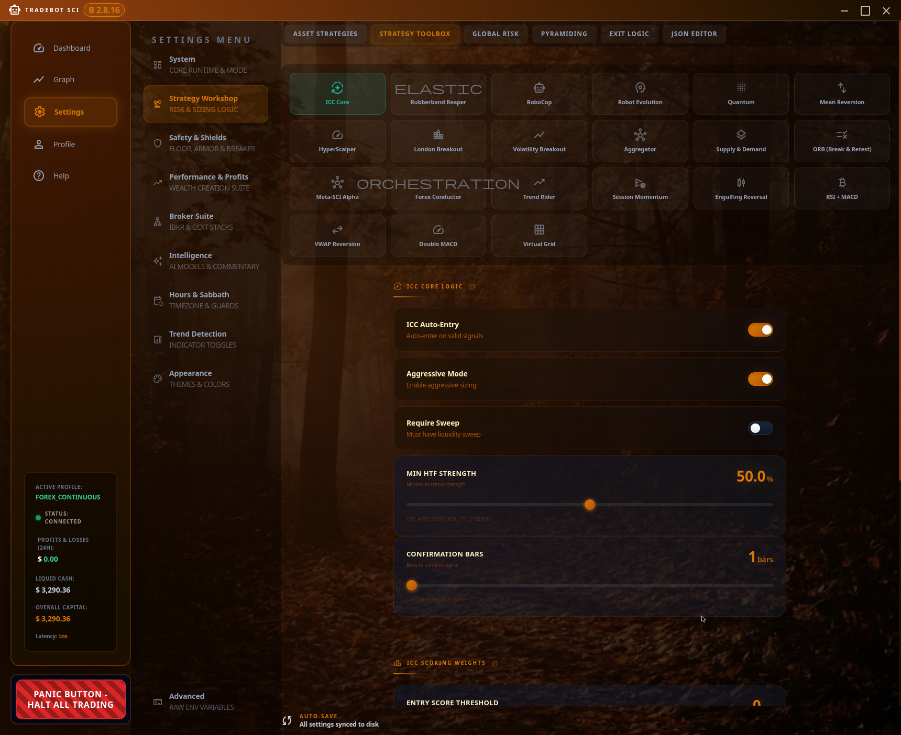

# Tradebot SCI — Multi-Strategy Trading System



> An automated trading system supporting forex, crypto, metals, and more across Interactive Brokers, OANDA, Gemini, Coinbase, and Kraken. Multiple strategies, configurable risk, and a polished Electron GUI.

---

## Sleek, Themeable Interface

Choose from **16+ premium themes** — each with a unique background, color palette, and mood. Switch instantly from Settings → Appearance.

### Aurora Borealis
<table>
<tr>
<td width="50%"></td>
<td width="50%"></td>
</tr>
</table>

### Magical Girl
<table>
<tr>
<td width="50%"></td>
<td width="50%"></td>
</tr>
</table>

### Ember / Autumn Harvest
<table>
<tr>
<td width="50%"></td>
<td width="50%"></td>
</tr>
</table>

---

> [!CAUTION]
> **USE AT YOUR OWN RISK.**
>
> The author is in **no way, shape, or form responsible** for what this application may or may not do.
>
> This is an automated trading tool that executes real orders with real money. If you decide to put your life savings into an account and have the bot gamble it away, **that is on you.**
>
> **You have been warned.** Test thoroughly on paper/sim before risking a Single. Cent.

---

## Features

- **17 Trading Strategies** — Mean reversion, breakout, scalping, trend-following, and more
- **Per-Asset Strategy Selection** — Assign different strategies to forex, crypto, stocks, etc.
- **Multi-Broker Support** — OANDA, Interactive Brokers, Gemini, Coinbase, Kraken (via CCXT)
- **Electron GUI Dashboard** — Real-time charts, holdings, decisions panel, system logs
- **16+ Themes** — Premium visual themes with animated backgrounds
- **Sabbath Mode** — Automatic trading pause with local paper-trading simulation
- **Position Lock** — Prevents strategy whiplash on the same symbol
- **Fee & Spread Awareness** — Per-broker fee deduction for accurate PnL
- **Configurable Risk** — Tiered sizing, max daily loss, breakeven trailing

---

## Trading Strategies

17 strategies organized by market condition. **No strategy is guaranteed to be profitable.** Backtest results do not predict live performance.

#### Trending Market
| Strategy | Style | Description |
|----------|-------|-------------|
| **Supply & Demand** | Zone Trading | Identifies supply/demand zones for entries |
| **RoboCop** | Aggressive Scalping | 1-bar confirmation, fast ATR targets |
| **HyperScalper** | Fast Scalping | 9/21/200 EMA crossover system |
| **Trend Rider** | Trend Following | Rides directional momentum |
| **Quantum** | Trend Following | SMA pullback entries in strong trends |

#### Ranging / Reversal
| Strategy | Style | Description |
|----------|-------|-------------|
| **Rubberband Reaper** | Mean Reversion | Adaptive sizing for volatile ranging markets |
| **ICC Core** | Structure Trading | Indication → Correction → Continuation framework |
| **Mean Reversion** | Mean Reversion | Bollinger Band + RSI extreme entries |
| **Bearish Engulfing** | Candlestick Reversal | Engulfing pattern detection with confirmation |

#### Session-Based
| Strategy | Style | Description |
|----------|-------|-------------|
| **London Breakout** | Breakout | European session opening range breakouts |
| **ORB Breakout** | Breakout | Opening Range Breakout strategy |
| **Session Momentum** | Momentum | Rides session-open momentum |

#### Crypto-Specific
| Strategy | Style | Description |
|----------|-------|-------------|
| **Crypto RSI/MACD** | Oscillator | RSI + MACD crossover for crypto |
| **Crypto VWAP Reversion** | Mean Reversion | VWAP deviation entries |
| **Crypto Double MACD** | Dual Timeframe | Multi-MACD confirmation |
| **Crypto Grid** | Grid Trading | Range-bound grid entries |

#### Meta Engine
| Strategy | Style | Description |
|----------|-------|-------------|
| **Meta-SCI** | Adaptive Tournament | Runs all strategies in parallel, picks the best signal per market regime. Champion/Challenger system with regime detection |

### Per-Asset Strategy Assignment

```yaml
# Default: meta_sci runs all strategies in a tournament and picks the best
strategy_variant: meta_sci

# Or assign specific strategies per asset class:
strategies:
  crypto: meta_sci
  forex: meta_sci
  stocks: quantum
  etf: quantum
  metals: mean_reversion
```

Configure in **Settings → Strategy Workshop → Asset Strategies**.

---

## Supported Brokers

| Broker | Asset Classes | Fee Handling | Status |
|--------|---------------|--------------|--------|
| **OANDA** | Forex, Metals | Spread-aware (configurable avg pips) | Full Support |
| **Interactive Brokers** | Stocks, ETFs, Forex, Futures | Commission-based | Full Support |
| **Gemini (CCXT)** | Crypto Spot | 0.40% taker / maker-first logic | Full Support |
| **Coinbase (CCXT)** | Crypto Spot, Nano Futures | 0.60% taker | Full Support |
| **Kraken (CCXT)** | Crypto Spot, Margin | 0.26% taker / 0.16% maker | Ready |
| **Other CCXT Exchanges** | Crypto | Default 0.40% | Experimental |

---

## 1. Prerequisites

1. **Python 3.11+**
2. **Poetry** — `pip install poetry`
3. **Node.js 18+** — For the Electron GUI (optional but recommended)
4. **Broker Access** (at least one):
   - **IBKR TWS/Gateway** — Port 7497 (paper) or 7496 (live)
   - **OANDA Account** — API key from OANDA Hub
   - **Coinbase/Gemini/Kraken** — API key + secret
5. **AI Provider Key** — OpenAI, Gemini, Claude, or DeepSeek

---

## 2. Installation

### 🐧 Linux (Ubuntu, Debian, Fedora, Arch) & 🍎 macOS
```bash
git clone https://gitlab.com/ultraedge/tradebot-public.git
cd tradebot-public
chmod +x scripts/install.sh && ./scripts/install.sh
```
> **macOS Note**: The installer uses Homebrew (`brew`) to install dependencies and creates a clickable `.command` launcher on your Desktop.

### 🪟 Windows
1.  **Download**: `git clone https://gitlab.com/ultraedge/tradebot-public.git` or [Download ZIP](https://gitlab.com/ultraedge/tradebot-public/-/archive/main/tradebot-public-main.zip)
2.  **Install**: Right-click `scripts/windows_installer.ps1` → "Run with PowerShell"
3.  **Done!** Double-click the `Tradebot SCI` icon on your desktop.

### Manual Setup
```bash
poetry install --with gui
cp .env.example .env
# Edit .env with your API keys
```

Key environment variables:
```bash
# AI Provider
TRADE_SCI_PROVIDER=gemini
CHATGPT_KEY=your-api-key

# Broker (choose one or more)
OANDA_ACCOUNT_ID=101-001-xxxxx-001
OANDA_API_KEY=your-oanda-token

CCXT_EXCHANGE=gemini
CCXT_API_KEY=your-key
CCXT_SECRET=your-secret

IBKR_HOST=127.0.0.1
IBKR_PORT=7497
```

---

## 3. Launch

### GUI Mode (Recommended)
```bash
./scripts/tradebot.sh --gui
```

This opens the dashboard where you can:
- Start/Stop the bot
- Monitor trades, holdings, and decisions in real-time
- Adjust all settings with visual controls
- Switch between 16+ themes

### Settings Only
```bash
./scripts/tradebot.sh --settings
```


### Headless / Terminal Mode
```bash
./scripts/tradebot.sh
./scripts/tradebot.sh --profile forex_continuous
./scripts/tradebot.sh --profile crypto_247 --mode continuous
```

---

## 4. Configuration Profiles

| Profile | Focus | Session |
|---------|-------|---------|
| `forex_continuous` | Forex pairs via OANDA | 24/7 (Sabbath pause) |
| `forex_crypto_hybrid` | Forex + Crypto combined | 24/7 |
| `forex_intraday` | Forex via IBKR | Market hours |
| `crypto_247` | Crypto spot via CCXT | 24/7 |
| `all_247` | All assets combined | 24/7 |
| `oanda_multi_asset` | Forex + Metals via OANDA | 24/7 |
| `coinbase_futures` | Crypto futures | 24/7 |
| `coinbase_futures_nano` | Nano BTC/ETH futures | 24/7 |
| `auto_schedule` | Auto-switches by market hours | Smart scheduling |
| `intraday` | Equities intraday via IBKR | Market hours |
| `swing` | Multi-day holds | Daily candles |
| `scalp` | 1-minute scalping | Any |

Select your profile in **Settings → System → Active Profile**.

---

## 5. Risk Management

### Tiered Risk System

Risk per trade scales with account size:

| Account Size | Risk Per Trade |
|--------------|----------------|
| Below $500 | 5% (micro account growth) |
| $500–$2,000 | 2–3% (small account) |
| $2,000–$10,000 | 1–2% (standard) |
| Above $10,000 | 0.5–1% (capital preservation) |

> [!WARNING]
> Even with tiered risk, **losses are inevitable**. No risk system eliminates losing trades. The goal is to keep losses small and let winners run.

### Safety Features

- **Max Daily Loss** — Circuit breaker stops all trading if threshold exceeded
- **Sabbath Mode** — Auto-pause Friday sunset to Saturday sunset (paper trades locally during pause)
- **Position Lock** — Prevents conflicting signals from flipping an active position
- **Breakeven Trailing** — Moves stops to entry price once trade is in profit
- **Session Gates** — Only trade during liquid market hours

---

## 6. How It Works

### ICC Framework (Indication → Correction → Continuation)

1. **Indication** — Market breaks structure in a direction
2. **Correction** — Price retraces (creates entry opportunity)
3. **Continuation** — Enter on confirmed trend resumption

### Multi-Timeframe Analysis

- **HTF (Higher Timeframe)** — Determines trend direction
- **LTF (Lower Timeframe)** — Precision entry timing
- **Alignment Required** — Only trade when timeframes agree

### AI Integration (Optional)

- Market context analysis via LLM
- Setup quality scoring
- Trade journaling and commentary

---

## 7. Documentation

| Topic | Document |
|-------|----------|
| **Philosophy** | [01_PHILOSOPHY.md](Documentation/RTFM/01_PHILOSOPHY.md) |
| **Architecture** | [02_SKELETON_ARCH.md](Documentation/RTFM/02_SKELETON_ARCH.md) |
| **Controls** | [07_COCKPIT_CONTROLS.md](Documentation/RTFM/07_COCKPIT_CONTROLS.md) |
| **Environment Vars** | [13_ENV_VARS.md](Documentation/RTFM/13_ENV_VARS.md) |
| **Backtesting** | [12_TIME_MACHINE.md](Documentation/RTFM/12_TIME_MACHINE.md) |

---

## 8. Important Notes

- **`EXECUTE_TRADES=false` by default** — You must explicitly enable live trading
- **Paper trade first** — Use IBKR paper (7497), OANDA practice, or Sabbath mode
- **Start small** — Test with minimum position sizes before scaling up
- **Monitor actively** — Don't set and forget until you understand the system
- **No guarantees** — Past backtest performance does not predict future results

---

## Command Reference

```bash
# Launch GUI dashboard
./scripts/tradebot.sh --gui

# Open settings only
./scripts/tradebot.sh --settings

# Terminal mode with specific profile
./scripts/tradebot.sh --profile forex_continuous

# Help
./scripts/tradebot.sh --help

# Run the Electron GUI directly
cd src/tradebot_sci/electron_gui && npm start
```

---

## License & Disclaimer

This software is provided as-is. **Trading involves substantial risk of loss.** Past performance does not guarantee future results. The developers are not financial advisors and this is not financial advice. You are solely responsible for any trades executed by this software.
