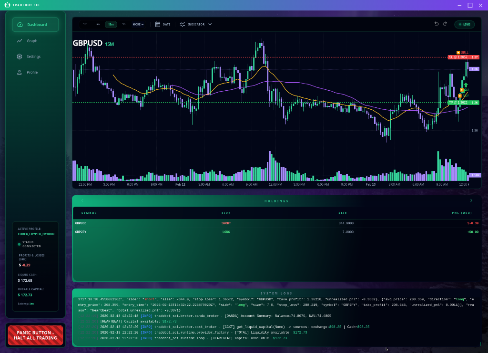
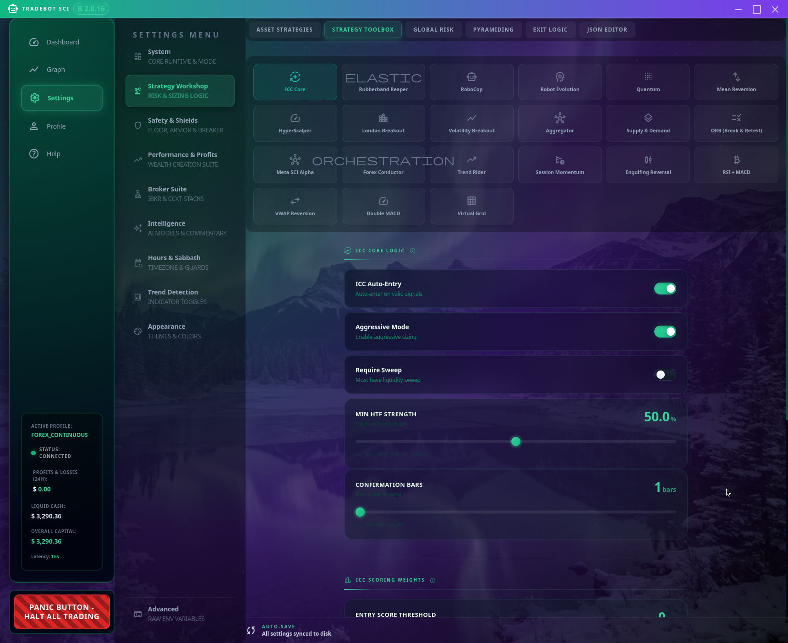
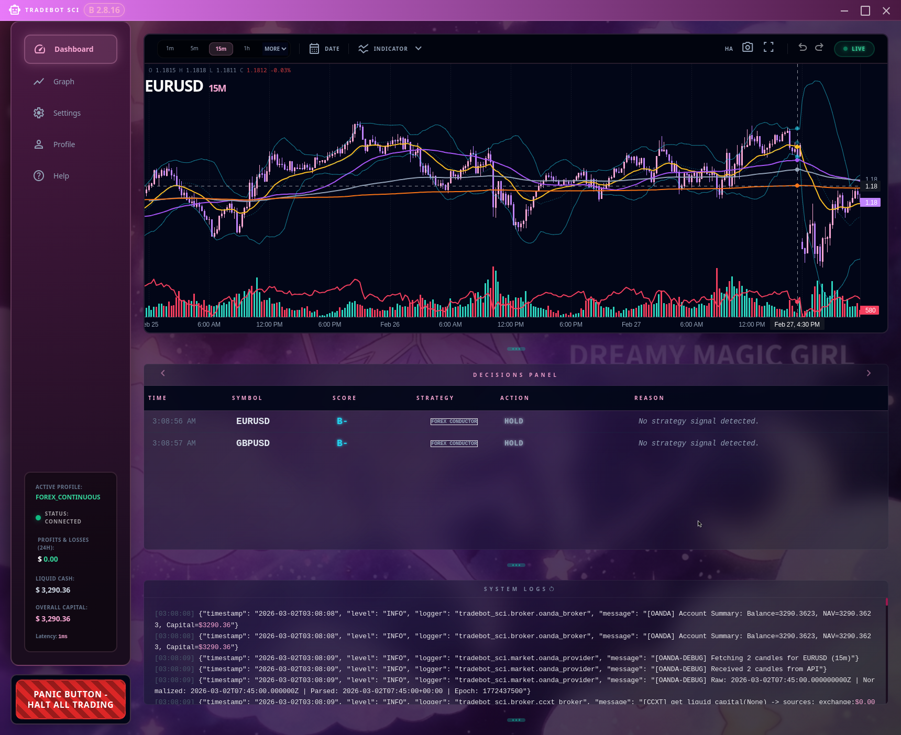
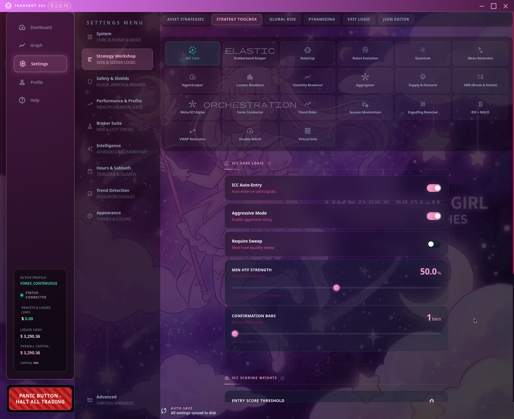
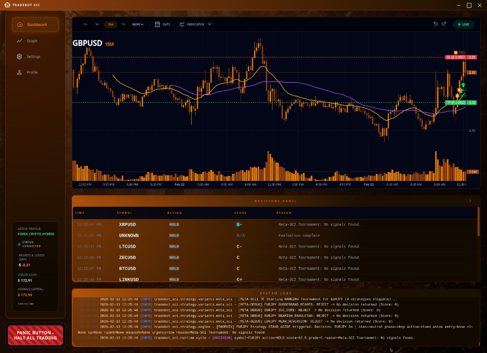
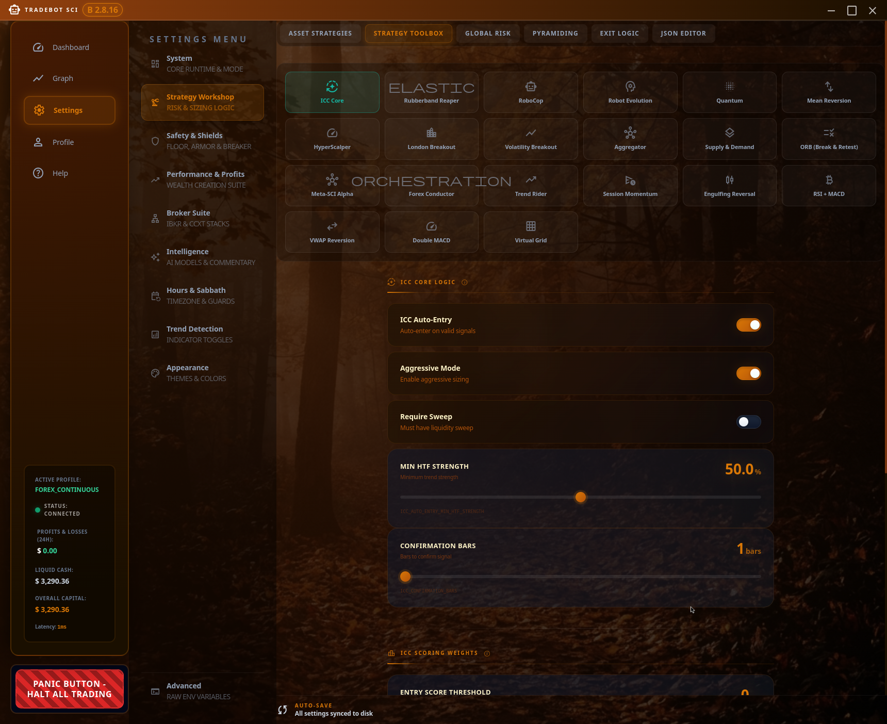

# Tradebot SCI



> An automated trading system for forex, crypto, metals and more, with a desktop dashboard.
> Works with OANDA, Interactive Brokers, Gemini, Coinbase and Kraken.

---

# ⚡ Install

**Find your computer below and follow the steps. That's the whole thing.**

## 🪟 Windows

1. **[Download the installer](https://gitlab.com/ultraedge/tradebot-public/-/releases)** — click **Windows Setup**. It arrives as a `.zip`.
2. **Unzip it**, then **double-click `Tradebot-SCI-Setup-....exe`.** A black window opens and sets everything up. Give it a few minutes.
3. **Double-click "Tradebot SCI" on your Desktop** when it says it's done.

You do **not** need to install Python, Node.js, or Git first. The setup program handles all of that.

## 🍎 macOS

1. Open **Terminal** — press `Cmd + Space`, type `Terminal`, press Enter.
2. **Copy this whole block, paste it in, press Enter:**

```bash
git clone https://gitlab.com/ultraedge/tradebot-public.git
cd tradebot-public
./scripts/install_mac.sh
```

3. When it finishes, **double-click "Tradebot SCI" on your Desktop**.

**No Homebrew. No Xcode Command Line Tools. No password prompt.** Everything goes into the folder you just cloned and your `~/.local` folder.

## 🐧 Linux

1. **[Download the AppImage](https://gitlab.com/ultraedge/tradebot-public/-/releases)** — click
   **Linux AppImage**. It arrives as a `.zip`.
2. **Unzip it**, then run these two lines:

```bash
chmod +x Tradebot-SCI-*.AppImage
./Tradebot-SCI-*.AppImage
```

3. That's it. The dashboard opens and **sets Python up by itself on that first launch** — a few
   minutes, once, in the background while you look around. Every launch after that is instant.

That's the whole thing. No git, no Node.js, no system packages, no password prompt, and nothing
to click. Nothing is installed outside your home folder.

<details>
<summary><b>Prefer to install from source?</b> — headless servers, or if you want to hack on the code</summary>

```bash
git clone https://gitlab.com/ultraedge/tradebot-public.git
cd tradebot-public
./scripts/install.sh
```

This asks for your password once, to install system packages. Choose it if you want the bot running
headless, want to modify the code, or would rather manage the Python environment yourself.
</details>

---

# 🔑 Add your API keys

The bot needs at least one broker and one AI key. Open the file called `.env` in the folder
you installed into, and fill in the parts you use. Anything you don't use, leave blank.

```bash
# ── AI provider (pick one) ───────────────────────────────────
TRADE_SCI_PROVIDER=gemini
GEMINI_API_KEY=your-key-here

# ── Broker (pick one or more) ────────────────────────────────
OANDA_ACCOUNT_ID=101-001-xxxxxxx-001
OANDA_API_KEY=your-oanda-token

# Or Interactive Brokers (TWS or Gateway must be running)
IBKR_HOST=127.0.0.1
IBKR_PORT=7497

# Or a crypto exchange
CCXT_EXCHANGE=gemini
CCXT_API_KEY=your-key
CCXT_SECRET=your-secret
```

Not sure where to get these? See **[Documentation/RTFM/13_API_SETUP.md](Documentation/RTFM/13_API_SETUP.md)**.

---

# ▶️ Start it

Click the **Tradebot SCI** icon on your Desktop. That's it.

Or from a terminal:

```bash
./scripts/tradebot.sh --gui        # the dashboard (recommended)
./scripts/tradebot.sh              # headless, terminal only
./scripts/tradebot.sh --help       # all the options
```

In the dashboard you can start and stop the bot, watch trades come in, and change every
setting with buttons instead of editing files.

---

# 🆘 Stuck?

| Problem | Fix |
|---|---|
| **"command not found: git"** | Install Git first — [git-scm.com/downloads](https://git-scm.com/downloads) |
| **Nothing happens when I double-click** | On macOS, right-click → Open (once). macOS blocks new apps by default. |
| **Windows: "Windows protected your PC"** | Click **More info** → **Run anyway**. The installer isn't code-signed. |
| **The bot starts but never trades** | Check your `.env` keys are filled in, and that the market is open. Forex is closed from Friday 5pm to Sunday 5pm New York time. |
| **"No module named ..."** | The install didn't finish. Re-run the installer for your system. |
| **I want to start over** | Delete the `.venv` folder and re-run the installer. |

More help: **[Documentation/RTFM/](Documentation/RTFM/)** — it's written for humans, not developers.

---

> [!CAUTION]
> **USE AT YOUR OWN RISK.**
>
> The author is in **no way, shape, or form responsible** for what this application may or may not do.
>
> This is an automated trading tool that executes real orders with real money. If you decide to put your life savings into an account and have the bot gamble it away, **that is on you.**
>
> **You have been warned.** Test thoroughly on paper/sim before risking a Single. Cent.

---

# What's in it

- **28 trading strategies** — mean reversion, breakout, scalping, trend following, quantitative filters and more
- **Any market** — forex, crypto, metals, equities, futures
- **Five brokers** — OANDA, Interactive Brokers, Gemini, Coinbase, Kraken
- **16+ themes** — switch instantly from Settings → Appearance
- **Safety controls** — daily loss limits, position caps, weekend protection, an emergency stop
- **Paper trading** — practise with simulated money before risking a cent
- **Backtesting** — replay years of history in seconds

## Supported brokers

| Broker | Markets | Notes |
|---|---|---|
| **OANDA** | Forex, metals | Easiest to start with. Free practice account. |
| **Interactive Brokers** | Everything | Needs TWS or Gateway running locally |
| **Gemini** | Crypto | US-regulated |
| **Coinbase** | Crypto | Including nano futures |
| **Kraken** | Crypto | Spot |

## Trading strategies

Grouped by what they do:

| Family | Strategies |
|---|---|
| **Mean reversion** | Rubberband Reaper, ICC Core, Engulfing Reversal, Golden Pocket, Yo-Yo |
| **Breakout** | Structure Breakout, London Breakout, ORB, Volatility Breakout, London Sweep |
| **Trend following** | Trend Rider, Session Momentum, New York Drive, Quantum |
| **Scraping** | Forex Scrape Fade — fades an overextended range break |
| **Quantitative** | 200-SMA filter, Golden Cross, RSI-2, 3/10 trend, Choppiness, seasonal |
| **Ensembles** | Meta-SCI (runs a tournament and picks the best), Singularity Aggregator |
| **Crypto-specific** | RSI+MACD, VWAP reversion, Double MACD, Virtual Grid |

### Assigning strategies

By default `meta_sci` runs a tournament and picks the winner itself. You can also pin one
strategy to one asset class:

```python
# In your profile settings
"strategies": {
    "forex": "forex_scrape_fade",
    "crypto": "rubberband_reaper",
    "stocks": "robocop",
}
```

Adding a brand new strategy? Follow **[Documentation/ADDING_A_STRATEGY.md](Documentation/ADDING_A_STRATEGY.md)** —
it lists every file that needs updating. Skipping a step gives you a strategy the dashboard can't see.

## Configuration profiles

| Profile | Focus | Session |
|---|---|---|
| `forex_continuous` | Forex via OANDA | 24/7 |
| `forex_crypto_hybrid` | Forex + crypto | 24/7 |
| `forex_intraday` | Forex via IBKR | Market hours |
| `crypto_247` | Crypto spot | 24/7 |
| `all_247` | Everything | 24/7 |
| `oanda_multi_asset` | Forex + metals | 24/7 |
| `auto_schedule` | Switches by market hours | Smart |
| `scalp` / `swing` / `intraday` | 1m scalping / multi-day / equities | Varies |

Pick one in **Settings → System → Active Profile**.

---

# How it works

### The ICC framework

Entries come from **Indication → Correction → Continuation**: the market shows intent, pulls
back, then resumes. The bot waits for all three before committing.

### Multiple timeframes

Every decision considers a higher timeframe for direction, a middle one for structure, and a
lower one for timing.

### Risk control

- **Tiered risk** — position size scales with account size and setup quality
- **Daily loss limit** — stops trading for the day when the limit is hit
- **Weekend protection** — no forex entries while the market is closed (wider spreads)
- **Paper mode** — the default. Nothing touches real money until you turn it on.

### AI (optional)

An AI provider can review decisions and tune settings. The bot runs fine without one — you
just lose the commentary and automatic optimisation.

---

# Themes

Choose from **16+ themes**, each with its own background, palette and mood. Switch instantly
from Settings → Appearance.

### Aurora Borealis
<table>
<tr>
<td width="50%"></td>
<td width="50%"></td>
</tr>
</table>

### Magical Girl
<table>
<tr>
<td width="50%"></td>
<td width="50%"></td>
</tr>
</table>

### Ember / Autumn Harvest
<table>
<tr>
<td width="50%"></td>
<td width="50%"></td>
</tr>
</table>

---

# Documentation

| Document | What's in it |
|---|---|
| [RTFM/](Documentation/RTFM/) | The full manual, written for humans |
| [API setup](Documentation/RTFM/13_API_SETUP.md) | Getting broker and AI keys |
| [Adding a strategy](Documentation/ADDING_A_STRATEGY.md) | The complete checklist |
| [Research](Documentation/Research/) | What we measured, including what didn't work |

---

# For developers

<details>
<summary><b>Manual setup, build commands and packaging</b></summary>

### Manual setup

```bash
poetry install --with gui
cp .env.example .env        # then edit it
```

### Command reference

```bash
./scripts/tradebot.sh --gui                      # dashboard
./scripts/tradebot.sh --settings                 # settings window only
./scripts/tradebot.sh --profile forex_continuous # specific profile
./scripts/tradebot.sh --mode continuous          # never sleep
cd src/tradebot_sci/electron_gui && npm start    # GUI directly
```

### Tests

```bash
pytest tests/ -q
```

Some tests fail for environmental reasons (a missing optional package). Compare against a
baseline before blaming your change — see [AGENTS.md](AGENTS.md).

### Packaging

```bash
./scripts/build_appimage.sh     # Linux AppImage -> dist/
```

CI builds the AppImage automatically on every push to the public mirror, and attaches it to a
GitLab Release when you push a tag. See [.gitlab-ci.yml](.gitlab-ci.yml).

### Before you change anything modular

This codebase is deliberately modular, and that only works if changes follow the documented
path. Read **[AGENTS.md](AGENTS.md)** first.

</details>

---

# License & Disclaimer

Use at your own risk. This software is provided as-is, with no warranty of any kind.

Automated trading can lose money — quickly, and more than you expect. Nothing here is
financial advice. Test on paper first. Never trade money you can't afford to lose.
